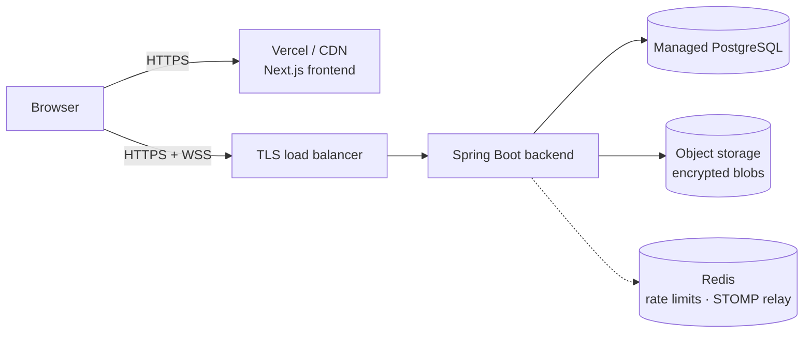

# Deployment and Suggestions

> **Suggestions only.** Nothing in this document is implemented in the repository. It describes what a production deployment would need and which features would strengthen CipherChat's security story next.

---

## Part 1: What is needed to deploy

### Target architecture



### 1. Frontend hosting

| Option | Notes |
|---|---|
| **Vercel** (recommended) | Built for Next.js. Supports the per-request CSP nonce (`src/proxy.ts`) because pages render dynamically. Set `API_URL` in project settings. |
| Netlify / Cloudflare Pages | Work with Next.js adapters; check that Proxy (middleware) runs so the CSP nonce is applied. |
| Same container platform as the backend | The frontend `Dockerfile` already produces a small standalone Node image. |

### 2. Backend hosting

| Option | Good for | Watch out for |
|---|---|---|
| **Render** | Simplest Docker deploy, managed Postgres in the same dashboard. | Free tier sleeps, which drops WebSocket connections. |
| **Railway** | Fast setup from the repo; Postgres plugin. | Usage-based pricing. |
| **Fly.io** | Global regions, persistent volumes, WebSockets work well. | Slightly more CLI-driven. |
| **VPS** (Hetzner, DigitalOcean, Lightsail) | Full control, cheapest at scale; run `docker compose` behind Caddy/Nginx. | You own OS patching, backups and monitoring. |

Requirements for any host: **WebSocket support** (`/ws`), **health check** on `/actuator/health`, and the JVM needs about 512 MB RAM.

If the backend sits behind a proxy, set `server.forward-headers-strategy=native` so rate limiting sees the real client IP (see `ClientIpResolver`).

### 3. Managed PostgreSQL

Neon, Supabase, Render/Railway Postgres, AWS RDS or Google Cloud SQL. Enable **TLS** (`?sslmode=require` in `DB_URL`), **automated backups with point-in-time recovery**, and a **least-privilege** database user. Flyway runs migrations on startup; in larger setups, run them as a separate release step.

### 4. Object storage for encrypted attachments

Attachments are currently written to a local volume (`AttachmentStorage`). In production, replace that class with an S3-compatible implementation: **AWS S3, Cloudflare R2, Backblaze B2 or MinIO**.

- Blobs are already client-encrypted, so the bucket only ever holds ciphertext. Keep it **private** anyway and enable server-side encryption as defence in depth.
- Serve downloads through the backend (as now) or through short-lived **pre-signed URLs** after the participant check.
- Add a **lifecycle rule** to delete orphaned uploads (uploaded but never attached to a message) after 24 hours.

### 5. Domain and HTTPS

- Buy a domain (e.g. `cipherchat.app`) and point `app.` to the frontend and `api.` to the backend.
- HTTPS is automatic on Vercel/Render/Railway/Fly. On a VPS, use **Caddy** (automatic Let's Encrypt) or Nginx + Certbot.
- Enable **HSTS preload** once HTTPS is stable. The backend and frontend already send `Strict-Transport-Security`.
- The browser crypto APIs that OpenPGP.js uses require a **secure context (HTTPS)** outside `localhost`.

### 6. Environment variables

| Variable | Service | Example / note |
|---|---|---|
| `JWT_SECRET` | backend | **Required.** 32+ random bytes, e.g. `openssl rand -base64 48`. Store in the host's secret manager. |
| `JWT_TTL` | backend | `PT12H` (ISO-8601 duration) |
| `DB_URL` | backend | `jdbc:postgresql://host:5432/cipherchat?sslmode=require` |
| `DB_USERNAME` / `DB_PASSWORD` | backend | From the managed database |
| `CORS_ALLOWED_ORIGIN` | backend | `https://app.cipherchat.app`. Must exactly match the frontend origin. |
| `ATTACHMENTS_DIR` | backend | Only for the disk storage; replaced by bucket settings with object storage |
| `PORT` | backend | Most platforms inject this automatically |
| `API_URL` | frontend | `https://api.cipherchat.app`, read at request time and used in the CSP `connect-src` |

Never commit real values. `.env.example` files document the names only.

### 7. CI/CD with GitHub Actions

A suggested pipeline (`.github/workflows/ci.yml`):

```yaml
name: ci
on: [push, pull_request]
jobs:
  backend:
    runs-on: ubuntu-latest
    steps:
      - uses: actions/checkout@v4
      - uses: actions/setup-java@v4
        with: { distribution: temurin, java-version: "21", cache: maven }
      - run: ./mvnw -B verify
        working-directory: backend
  frontend:
    runs-on: ubuntu-latest
    steps:
      - uses: actions/checkout@v4
      - uses: actions/setup-node@v4
        with: { node-version: "22", cache: npm, cache-dependency-path: frontend/package-lock.json }
      - run: npm ci && npm run lint && npm run build
        working-directory: frontend
  e2e:
    needs: [backend, frontend]
    runs-on: ubuntu-latest
    steps:
      - uses: actions/checkout@v4
      - run: cp .env.example .env && docker compose up -d --build --wait
      - run: cd frontend && npm ci && CHROME_PATH=$(which google-chrome) npm run test:e2e
```

Then add a **deploy job on `main`**: build and push images to GitHub Container Registry, then trigger the host's deploy hook (Render/Railway/Fly), with **branch protection** requiring CI to pass and **environment secrets** for production.

---

## Part 2: Features that would impress a cybersecurity company

Ordered roughly by security value versus effort.

| # | Feature | Why it matters |
|---|---|---|
| 1 | **Threat model document** (STRIDE, data-flow diagram, trust boundaries) | Shows the design is deliberate. It would state plainly what the server *can* still do (see metadata, withhold or reorder messages, serve a malicious frontend) and how each risk is mitigated. |
| 2 | **Fingerprint QR verification** | Scanning a contact's QR code in person is faster and less error-prone than comparing 40 hex characters. It builds on the existing trust-on-first-use pinning and "verified" state. |
| 3 | **Forward secrecy and key rotation** | Today a stolen private key plus passphrase decrypts all past messages. The Double Ratchet (Signal protocol) or MLS gives per-message keys; a simpler step is periodic encryption-subkey rotation with a signed key history. |
| 4 | **Zero-knowledge private key backup** | Let users store their *passphrase-encrypted* key on the server, derived with a strong KDF (Argon2id S2K), so they can log in on a new device without a file, while the server still cannot read it. |
| 5 | **2FA / TOTP and WebAuthn passkeys** | Protects accounts against password reuse and phishing. Passkeys are phishing-resistant by design. |
| 6 | **Disappearing messages** | A per-conversation timer after which ciphertext is deleted server-side (scheduled job) and plaintext is dropped client-side. This reduces exposure if a device or key is compromised later. |
| 7 | **Audit logging** | Append-only security events (logins, failed logins, key uploads or changes, rate-limit hits) with IP and user agent, never message content. Alert on anomalies such as a key change followed by a burst of messages. |
| 8 | **Stronger brute-force protection** | Move the in-memory limiter to **Redis** so it works across instances, add exponential back-off, CAPTCHA after repeated failures, and notify users of failed attempts. |
| 9 | **CSP and security headers report** | Add `report-to`/`report-uri` to the existing nonce-based CSP to collect violations, publish an A+ from securityheaders.com / Mozilla Observatory, and adopt Trusted Types. |
| 10 | **Subresource integrity / reproducible frontend builds** | The biggest remaining risk in web E2EE is the server shipping modified JavaScript. Signed, reproducible builds (or a browser extension that pins the bundle hash) address it. |
| 11 | **Dependency scanning** | **Dependabot** for Maven, npm, Docker and Actions updates, plus **OWASP Dependency-Check** or `npm audit` in CI to fail builds on known CVEs. |
| 12 | **SAST with CodeQL** | GitHub CodeQL for Java and TypeScript on every PR catches injection, unsafe deserialisation and similar bug classes. |
| 13 | **Container image scanning** | **Trivy** or Grype on the built images in CI; switch to distroless / Chainguard base images and sign images with **Cosign**. |
| 14 | **Secret scanning and pre-commit hooks** | GitHub secret scanning with push protection plus `gitleaks` locally. |
| 15 | **Refresh tokens and session management** | Short-lived access tokens, rotating refresh tokens in `HttpOnly` cookies, and a "log out other sessions" button backed by a token deny-list. |
| 16 | **Metadata minimisation** | Pad ciphertext to fixed size buckets, hide online status, and consider sealed-sender style delivery so the server learns less about who talks to whom and how much. |
| 17 | **Security test suite in CI** | OWASP ZAP baseline scan against the running stack, plus unit tests that assert no plaintext ever reaches persistence. |
| 18 | **Responsible disclosure** | `SECURITY.md` with a contact and PGP key, and `security.txt` on the domain. |

### Already implemented (for context)

These are already implemented in the codebase:

- Browser-side key generation and encryption.
- Server-side BouncyCastle validation of keys, and a check that messages really are ciphertext addressed to both participants.
- Signature verification badges.
- Trust-on-first-use key pinning with key-change warnings.
- BCrypt, JWT on REST and STOMP.
- Per-username and per-IP login rate limiting.
- Strict CORS, a nonce-based CSP and other security headers.
- 404s instead of 403s to prevent id probing.
- Non-root containers.
