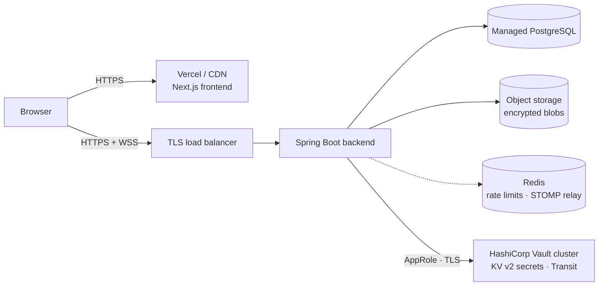

# Deployment and Suggestions

> **Suggestions only.** Apart from the list at the very end, nothing in this document is implemented in the repository. It describes what a production deployment would need and which features would strengthen CipherChat's security story next.

---

## Part 1: What is needed to deploy

### Target architecture



### 1. Frontend hosting

| Option | Notes |
|---|---|
| **Vercel** (recommended) | Built for Next.js. Supports the per-request CSP nonce (`src/proxy.ts`) because pages render dynamically. Set `API_URL` in project settings. |
| Netlify / Cloudflare Pages | Work with Next.js adapters; check that Proxy (middleware) runs so the CSP nonce is applied. |
| Same container platform as the backend | The frontend `Dockerfile` already produces a small standalone Node image. |

### 2. Backend hosting

| Option | Good for | Watch out for |
|---|---|---|
| **Render** | Simplest Docker deploy, managed Postgres in the same dashboard. | Free tier sleeps, which drops WebSocket connections. |
| **Railway** | Fast setup from the repo; Postgres plugin. | Usage-based pricing. |
| **Fly.io** | Global regions, persistent volumes, WebSockets work well. | Slightly more CLI-driven. |
| **VPS** (Hetzner, DigitalOcean, Lightsail) | Full control, cheapest at scale; run `docker compose` behind Caddy/Nginx. | You own OS patching, backups and monitoring. |

Requirements for any host: **WebSocket support** (`/ws`), **health check** on `/actuator/health`, and the JVM needs about 512 MB RAM.

If the backend sits behind a proxy, set `server.forward-headers-strategy=native` so rate limiting sees the real client IP (see `ClientIpResolver`).

### 3. Managed PostgreSQL

Neon, Supabase, Render/Railway Postgres, AWS RDS or Google Cloud SQL. Enable **TLS** (`?sslmode=require` in `DB_URL`), **automated backups with point-in-time recovery**, and a **least-privilege** database user. Flyway runs migrations on startup; in larger setups, run them as a separate release step.

### 4. Object storage for encrypted attachments

Attachments are currently written to a local volume (`AttachmentStorage`). In production, replace that class with an S3-compatible implementation: **AWS S3, Cloudflare R2, Backblaze B2 or MinIO**.

- Blobs are already client-encrypted, so the bucket only ever holds ciphertext. Keep it **private** anyway and enable server-side encryption as defence in depth.
- Serve downloads through the backend (as now) or through short-lived **pre-signed URLs** after the participant check.
- Add a **lifecycle rule** to delete orphaned uploads (uploaded but never attached to a message) after 24 hours.

### 5. Domain and HTTPS

- Buy a domain (e.g. `cipherchat.app`) and point `app.` to the frontend and `api.` to the backend.
- HTTPS is automatic on Vercel/Render/Railway/Fly. On a VPS, use **Caddy** (automatic Let's Encrypt) or Nginx + Certbot.
- Enable **HSTS preload** once HTTPS is stable. The backend and frontend already send `Strict-Transport-Security`.
- The browser crypto APIs that OpenPGP.js uses require a **secure context (HTTPS)** outside `localhost`.

### 6. Running Vault in production

Docker Compose runs Vault in **dev mode**: everything in memory, already unsealed, a root token in `.env`, plain HTTP. That is only for a laptop. The backend depends on Vault for its JWT secret, its database credentials and the Transit key that protects key backups, so in production Vault must be run as seriously as the database.

| Topic | What to do |
|---|---|
| **Hosting** | Use **HCP Vault Dedicated** (managed by HashiCorp) if you can. Self-hosted: a 3- or 5-node cluster with **Integrated Storage (Raft)**, spread over availability zones, on dedicated machines. Never `-dev`. |
| **TLS** | Serve the API only over TLS (`listener "tcp" { tls_cert_file … }`) and set `VAULT_URI=https://vault.internal:8200`. Do not expose Vault to the internet; allow only the backend's network. |
| **Unsealing** | Vault starts **sealed** after every restart. Use **auto-unseal** with a cloud KMS (AWS KMS, GCP Cloud KMS, Azure Key Vault) or an HSM, so restarts do not need humans. With manual Shamir unseal, give the key shares to different people and store them offline. |
| **Initial root token** | Use it once to set up auth methods and policies, then `vault token revoke` it. Generate a new one with `vault operator generate-root` only for emergencies. Store recovery keys offline. |
| **Configuration** | Apply what `vault/init.sh` does (KV v2 at `secret/`, the `cipherchat-key-backup` Transit key with `derived=true`, the `cipherchat-backend` policy, the AppRole) with **Terraform** (Vault provider) and review changes like code. In production the Transit key must **not** be `exportable` and must **not** allow plaintext backup (the script only does that for the dev volume). |
| **Backend login (auth method)** | Prefer a platform identity so no secret ID exists at all: **Kubernetes auth** (service account token) or **AWS/GCP/Azure auth** (instance identity). If you keep **AppRole**: the role ID can live in config, but deliver the secret ID per deployment with **response wrapping** (single use, short TTL) from CI, bind it with `secret_id_bound_cidrs`, and give it a short `secret_id_ttl`. Spring Cloud Vault supports all of these (`spring.cloud.vault.authentication`). |
| **Least privilege** | Keep the policy exactly as narrow as in `vault/init.sh`: read `secret/data/cipherchat`, `update` on `transit/encrypt` and `transit/decrypt` for one key. Admins use separate, audited identities (OIDC/SSO), never the backend's role. |
| **Database credentials** | Next step after KV: the **database secrets engine**, which creates a short-lived PostgreSQL user per backend instance (`spring.cloud.vault.database.enabled=true`). Run Flyway with a separate migration role so table ownership stays stable. |
| **Rotation** | Rotate the JWT secret by writing a new value to `secret/cipherchat` and restarting the backend (users sign in again). Rotate the Transit key on a schedule with `vault write -f transit/keys/cipherchat-key-backup/rotate`; old backups still decrypt, and a batch job can re-encrypt them with `transit/rewrap` before raising `min_decryption_version`. |
| **Backups** | Take **Raft snapshots** (`vault operator raft snapshot save`, or automated snapshots in Vault Enterprise / HCP) at least daily, encrypt them, store them off-site, and **test restores**. Without Vault's data (or with a lost Transit key), every stored key backup becomes unreadable: users could then only sign in on devices that are already set up. Back up the database and Vault together. |
| **Audit and monitoring** | Enable an **audit device** (`vault audit enable file …`) and ship the log to your SIEM; alert on denied requests from the backend's role and on any root token use. Scrape `/v1/sys/metrics` (Prometheus) and alert on `sealed`, leadership changes and Transit error rates. |
| **Availability** | If Vault is down, the backend cannot start, new sign-ups that include a backup fail, and new-device logins fail with `503`. Logins on devices already set up and normal messaging keep working while the backend runs. |

### 7. Environment variables

The JWT secret and database credentials are **not** environment variables any more: the backend reads `app.jwt.secret`, `spring.datasource.username` and `spring.datasource.password` from Vault KV v2 at `secret/cipherchat`.

| Variable | Service | Example / note |
|---|---|---|
| `VAULT_URI` | backend | `https://vault.internal:8200` |
| `VAULT_ROLE_ID` / `VAULT_SECRET_ID` | backend | AppRole login (or switch `spring.cloud.vault.authentication` to `KUBERNETES`, `AWS_IAM`, … and drop these). Deliver the secret ID at deploy time, never in a file in the repository. |
| `JWT_TTL` | backend | `PT12H` (ISO-8601 duration) |
| `DB_URL` | backend | `jdbc:postgresql://host:5432/cipherchat?sslmode=require` |
| `CORS_ALLOWED_ORIGIN` | backend | `https://app.cipherchat.app`. Must exactly match the frontend origin. |
| `ATTACHMENTS_DIR` | backend | Only for the disk storage; replaced by bucket settings with object storage |
| `PORT` | backend | Most platforms inject this automatically |
| `API_URL` | frontend | `https://api.cipherchat.app`, read at request time and used in the CSP `connect-src` |

Never commit real values. `.env.example` files document the names only.

### 8. CI/CD with GitHub Actions

A suggested pipeline (`.github/workflows/ci.yml`):

```yaml
name: ci
on: [push, pull_request]
jobs:
  backend:
    runs-on: ubuntu-latest
    steps:
      - uses: actions/checkout@v4
      - uses: actions/setup-java@v4
        with: { distribution: temurin, java-version: "21", cache: maven }
      # Integration tests start a real Vault with Testcontainers; GitHub's Ubuntu runners have Docker.
      - run: ./mvnw -B verify
        working-directory: backend
  frontend:
    runs-on: ubuntu-latest
    steps:
      - uses: actions/checkout@v4
      - uses: actions/setup-node@v4
        with: { node-version: "22", cache: npm, cache-dependency-path: frontend/package-lock.json }
      - run: npm ci && npm run lint && npm run build
        working-directory: frontend
  e2e:
    needs: [backend, frontend]
    runs-on: ubuntu-latest
    steps:
      - uses: actions/checkout@v4
      # .env.example only holds placeholders; the dev Vault and its init job are part of the stack.
      - run: cp .env.example .env && docker compose up -d --build --wait
      - run: cd frontend && npm ci && CHROME_PATH=$(which google-chrome) npm run test:e2e
```

Then add a **deploy job on `main`**: build and push images to GitHub Container Registry, then trigger the host's deploy hook (Render/Railway/Fly), with **branch protection** requiring CI to pass and **environment secrets** for production.

---

## Part 2: Features that would impress a cybersecurity company

Ordered roughly by security value versus effort.

| # | Feature | Why it matters |
|---|---|---|
| 1 | **Threat model document** (STRIDE, data-flow diagram, trust boundaries) | Shows the design is deliberate. It would state plainly what the server *can* still do (see metadata, withhold or reorder messages, serve a malicious frontend) and how each risk is mitigated. |
| 2 | **Fingerprint QR verification** | Scanning a contact's QR code in person is faster and less error-prone than comparing 40 hex characters. It builds on the existing trust-on-first-use pinning and "verified" state. |
| 3 | **Forward secrecy and key rotation** | Today a stolen private key (from an unlocked device, or a backup plus its passphrase) decrypts all past messages. The Double Ratchet (Signal protocol) or MLS gives per-message keys; a simpler step is periodic encryption-subkey rotation with a signed key history. |
| 4 | **Argon2 for the key backup** | The server-stored backup (now implemented) is locked with OpenPGP's iterated S2K for GnuPG compatibility. Switching to Argon2id S2K (RFC 9580, supported by OpenPGP.js) makes offline passphrase guessing far more expensive once GnuPG can read it. Pair it with a passphrase strength meter at sign-up. |
| 5 | **2FA / TOTP and WebAuthn passkeys** | Protects accounts against password reuse and phishing. Passkeys are phishing-resistant by design. |
| 6 | **Disappearing messages** | A per-conversation timer after which ciphertext is deleted server-side (scheduled job) and plaintext is dropped client-side. This reduces exposure if a device or key is compromised later. |
| 7 | **Audit logging** | Append-only security events (logins, failed logins, key uploads or changes, rate-limit hits) with IP and user agent, never message content. Alert on anomalies such as a key change followed by a burst of messages. |
| 8 | **Stronger brute-force protection** | Move the in-memory limiter to **Redis** so it works across instances, add exponential back-off, CAPTCHA after repeated failures, and notify users of failed attempts. |
| 9 | **CSP and security headers report** | Add `report-to`/`report-uri` to the existing nonce-based CSP to collect violations, publish an A+ from securityheaders.com / Mozilla Observatory, and adopt Trusted Types. |
| 10 | **Subresource integrity / reproducible frontend builds** | The biggest remaining risk in web E2EE is the server shipping modified JavaScript. Signed, reproducible builds (or a browser extension that pins the bundle hash) address it. |
| 11 | **Dependency scanning** | **Dependabot** for Maven, npm, Docker and Actions updates, plus **OWASP Dependency-Check** or `npm audit` in CI to fail builds on known CVEs. |
| 12 | **SAST with CodeQL** | GitHub CodeQL for Java and TypeScript on every PR catches injection, unsafe deserialisation and similar bug classes. |
| 13 | **Container image scanning** | **Trivy** or Grype on the built images in CI; switch to distroless / Chainguard base images and sign images with **Cosign**. |
| 14 | **Secret scanning and pre-commit hooks** | GitHub secret scanning with push protection plus `gitleaks` locally. |
| 15 | **Refresh tokens and session management** | Short-lived access tokens, rotating refresh tokens in `HttpOnly` cookies, and a "log out other sessions" button backed by a token deny-list. |
| 16 | **Metadata minimisation** | Pad ciphertext to fixed size buckets, hide online status, and consider sealed-sender style delivery so the server learns less about who talks to whom and how much. |
| 17 | **Security test suite in CI** | OWASP ZAP baseline scan against the running stack, plus unit tests that assert no plaintext ever reaches persistence. |
| 18 | **Responsible disclosure** | `SECURITY.md` with a contact and PGP key, and `security.txt` on the domain. |

### Already implemented (for context)

These are already implemented in the codebase:

- Browser-side key generation and encryption.
- Server-side BouncyCastle validation of keys, and a check that messages really are ciphertext addressed to both participants.
- Signature verification badges.
- Trust-on-first-use key pinning with key-change warnings.
- BCrypt, JWT on REST and STOMP.
- Per-username and per-IP login rate limiting.
- Strict CORS, a nonce-based CSP and other security headers.
- 404s instead of 403s to prevent id probing.
- Non-root containers.
- Passphrase asked once: the private key is kept on each device under a non-extractable WebCrypto AES-GCM key in IndexedDB; a passphrase-locked backup on the server sets up new devices.
- HashiCorp Vault: JWT secret and database credentials from KV v2 via Spring Cloud Vault (AppRole, least-privilege policy), and Transit envelope encryption of key backups, tested against a real Vault with Testcontainers.
