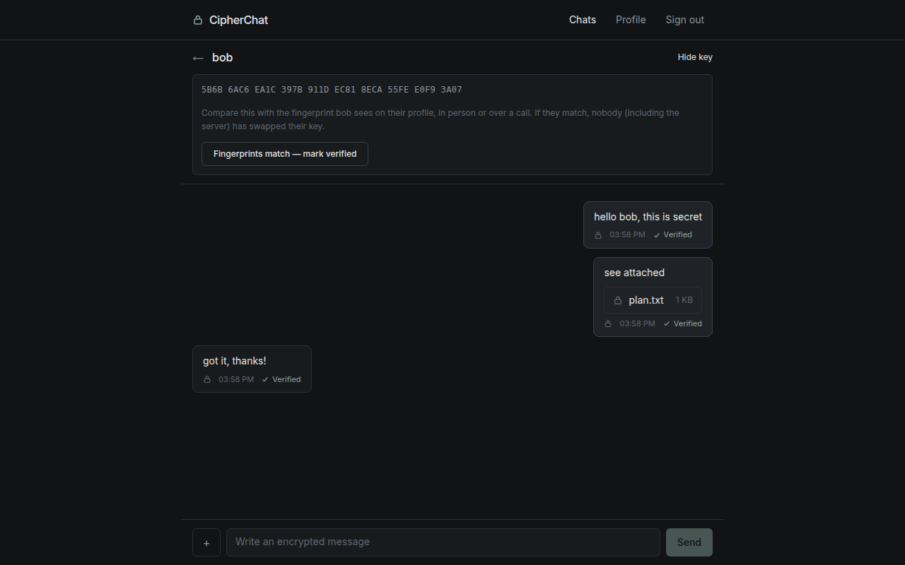
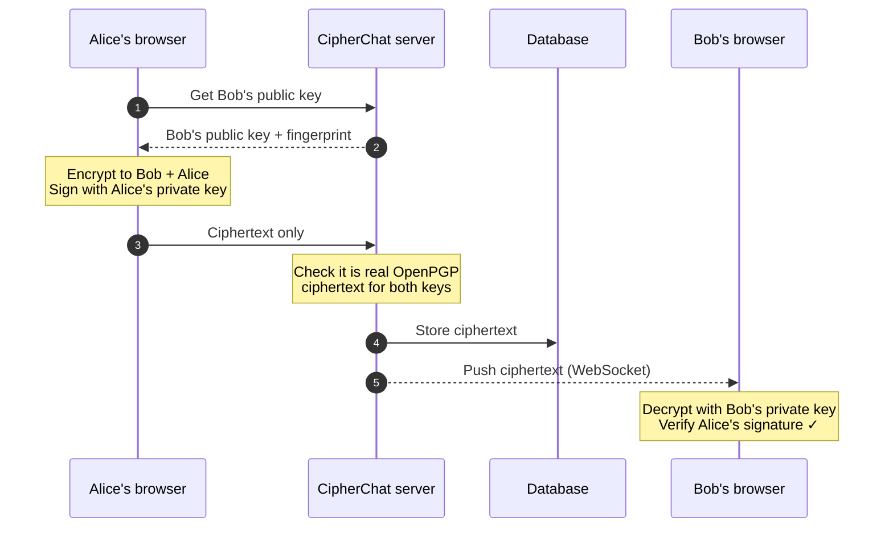
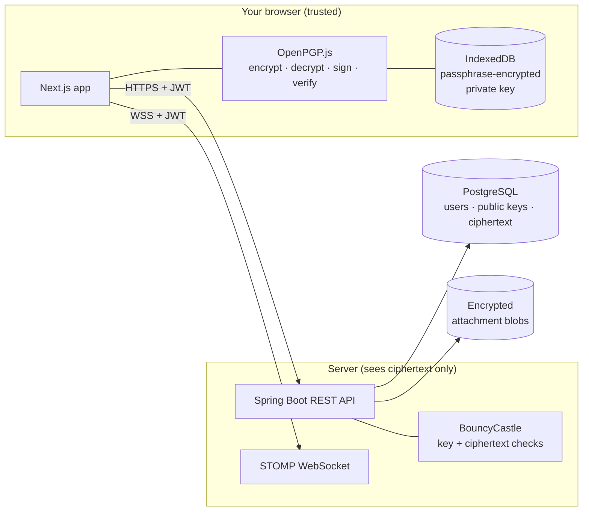
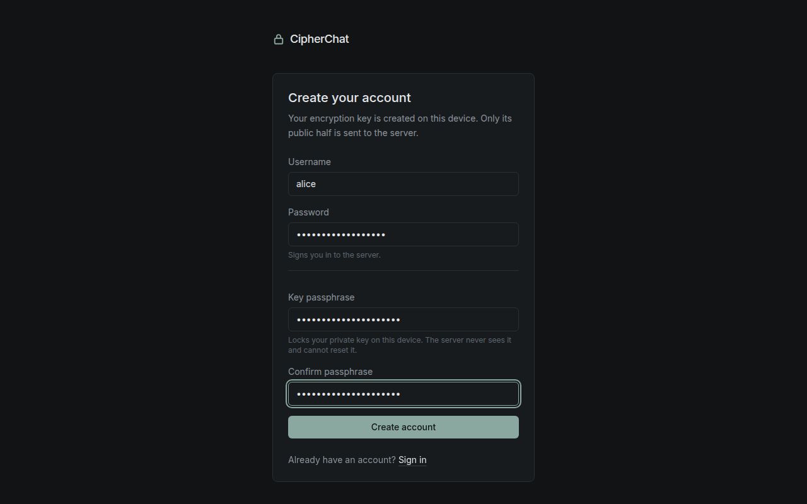
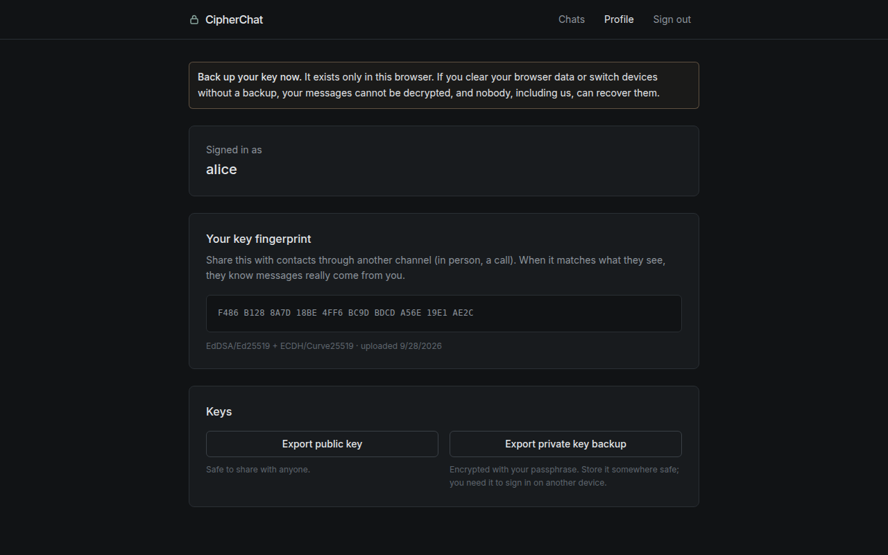
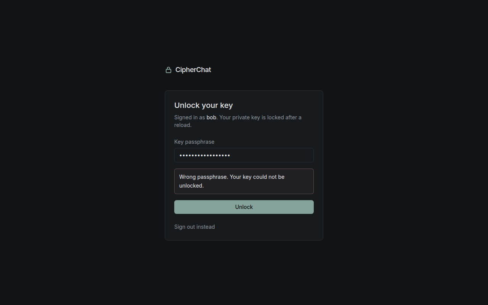
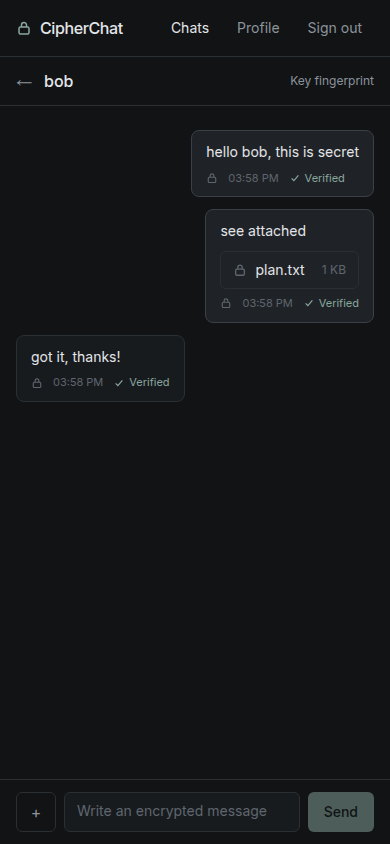

# CipherChat

**A private chat app where only you and the person you are talking to can read your messages. Not even the server that delivers them.**



---

## What it does, in plain language

CipherChat is a messaging app, like WhatsApp or Signal, built around one promise: **your messages are locked on your own device before they leave it, and they are only unlocked on the recipient's device.** Everything in between, including the internet, our server and our database, only ever sees scrambled text.

This is called **end-to-end encryption**. It matters because:

- **Servers get hacked.** If someone breaks into our database, they find only unreadable gibberish.
- **Insiders can be curious.** The people running the server cannot read your conversations either.
- **Networks can be watched.** Anyone listening in on your Wi-Fi sees nothing useful.

### The padlock analogy

Every user has a matching **padlock** and **key**:

| | In CipherChat | Who has it |
|---|---|---|
| 🔓 **Padlock** (public key) | Anyone can use it to *lock* a box addressed to you. | You hand out copies freely. The server keeps one so others can find it. |
| 🔑 **Key** (private key) | The only thing that can *open* those boxes. | **Only you**, on your own device, protected by a passphrase. It is never uploaded. |

When Alice writes to Bob, she puts the message in a box and snaps **Bob's padlock** shut on it. From that moment, only Bob's key can open it. Alice also snaps on a copy of **her own padlock**, so she can re-read what she sent.

Alice also adds her **signature** (a wax seal only she can make). When Bob opens the box, his app checks the seal. If it matches Alice, he sees **✓ Verified**. If someone tampered with the message or pretended to be Alice, he sees **⚠ Signature invalid**.

### How do I know the padlock really belongs to Bob?

Each padlock has a unique **fingerprint**, a 40-character code like `D04A 5925 0341 9EDA …`. You can compare it with Bob in person or on a call. If they match, you know nobody (not even our server) swapped Bob's padlock for a fake one. CipherChat also remembers each contact's fingerprint and **warns you loudly if it ever changes**.

---

## What happens when you send a message

1. **You type a message** (and optionally attach a file up to 10 MB).
2. **Your browser fetches Bob's padlock** (public key) from the server and checks it against the fingerprint it remembered last time.
3. **Your browser locks the message** with Bob's padlock *and* your own, and **signs** it with your private key. This happens entirely on your device.
4. **Only the locked box (ciphertext) is sent** to the server. The server double-checks that it really is locked for both of you, and refuses anything that looks like plain text.
5. **The server stores the locked box** and instantly **pushes it to Bob** over a live connection.
6. **Bob's browser unlocks it** with his private key (which is itself protected by his passphrase) and **checks your signature**, showing ✓ Verified.

Files work the same way: they are encrypted in your browser before upload, and decrypted in Bob's browser after download. Even the file's **name and type** are hidden inside the encrypted message.



### Architecture at a glance



---

## Screenshots

| Register (key created on your device) | Profile (fingerprint and key backup) |
|---|---|
|  |  |

| Wrong passphrase | Mobile |
|---|---|
|  |  |

---

## Technologies used, and why

| Technology | What it does here | Why we chose it |
|---|---|---|
| **OpenPGP** (the standard) | The "padlock and key" system used for all encryption and signatures. | A decades-old, openly reviewed standard (RFC 4880 / RFC 9580). Keys can be exported and used in other PGP tools such as GnuPG. |
| **Curve25519 / Ed25519** | The specific maths behind each key pair. | Modern, fast, small keys, and designed to be hard to get wrong. |
| **OpenPGP.js** | Does all encryption, decryption, signing and verification **inside your browser**. | The most widely used, independently audited OpenPGP library for JavaScript. |
| **IndexedDB** | Stores your private key in your browser, still locked with your passphrase. | Built into every modern browser; keeps the key on your device only. |
| **Next.js** (React) | Builds the web pages you interact with. | Popular, well supported, and lets us set strict security headers per request. |
| **TypeScript** | JavaScript with type checking. | Catches mistakes before they reach users. |
| **Tailwind CSS** | Styling (the calm dark look). | Consistent design with very little custom CSS. |
| **STOMP over WebSocket** (`@stomp/stompjs`) | Keeps a live connection open so new messages appear instantly. | A simple, standard messaging protocol that Spring supports natively. |
| **Spring Boot 3** (Java 21) | The server: accounts, public key directory, storing and relaying ciphertext. | Mature and secure by default, and widely used in industry. |
| **Spring Security** | Login protection, access rules, security headers, CORS. | The standard, battle-tested security layer for Java web apps. |
| **BCrypt** | Scrambles account passwords before storing them. | Deliberately slow, so stolen password hashes are very hard to crack. |
| **JWT** (jjwt) | A signed "entry pass" your browser shows on each request after login. | Stateless and simple, and works for both normal requests and the live connection. |
| **BouncyCastle** | Lets the server **check** public keys (well-formed, not expired, not a private key by mistake) and confirm messages really are encrypted. It never decrypts anything. | The reference cryptography library for Java, with full OpenPGP support. |
| **PostgreSQL** | Database for users, public keys, conversations and ciphertext. | Reliable, open source, and the industry standard. |
| **Flyway** | Versioned database setup scripts. | Every environment gets exactly the same database structure. |
| **H2** | An in-memory database used only by automated tests. | Tests run fast without needing a real database server. |
| **JUnit 5, MockMvc, Playwright** | Automated tests for the server and a full browser test of the real flow. | They prove encryption, verification and access rules actually work. |
| **springdoc-openapi (Swagger UI)** | Interactive API documentation in the browser. | Lets reviewers try every endpoint without writing code. |
| **Docker & Docker Compose** | Packages the database, server and website to start with one command. | "Works on my machine" becomes "works on every machine". |

---

## How to run the project

### Prerequisites

| To run with Docker (easiest) | To run manually |
|---|---|
| [Docker Desktop](https://www.docker.com/products/docker-desktop/) or Docker Engine with Compose v2 | **Java 21** (JDK) · **Node.js 22+** and npm · **PostgreSQL 15+** (or use Docker just for the database) |

A modern browser (Chrome, Firefox, Edge or Safari) is needed to use the app.

### Option A: Docker Compose (one command)

From the project folder:

```bash
cp .env.example .env && docker compose up --build
```

The first build takes a few minutes. When it is ready, open:

| What | URL |
|---|---|
| **The app** | <http://localhost:3000> |
| API | <http://localhost:8080> |
| Swagger UI (API explorer) | <http://localhost:8080/swagger-ui.html> |

> `.env.example` contains **development-only** placeholder secrets. For anything other than local testing, set a real `JWT_SECRET` (`openssl rand -base64 48`) and a strong `POSTGRES_PASSWORD` in `.env`.

To stop: `Ctrl+C`, then `docker compose down` (add `-v` to also delete the database and attachments).

### Option B: run backend and frontend manually

**1. Start a PostgreSQL database.** Either use your own, or run one in Docker:

```bash
docker run -d --name cipherchat-db -p 5432:5432 \
  -e POSTGRES_DB=cipherchat -e POSTGRES_USER=cipherchat -e POSTGRES_PASSWORD=change-me \
  postgres:17-alpine
```

**2. Start the backend** (terminal 1). The database tables are created automatically on first start.

```bash
cd backend
export JWT_SECRET="$(openssl rand -base64 48)"
export DB_URL=jdbc:postgresql://localhost:5432/cipherchat DB_USERNAME=cipherchat DB_PASSWORD=change-me
./mvnw spring-boot:run
```

The API runs on <http://localhost:8080> and Swagger UI on <http://localhost:8080/swagger-ui.html>. All settings are listed in [`backend/.env.example`](backend/.env.example).

**3. Start the frontend** (terminal 2):

```bash
cd frontend
npm install
npm run dev
```

Open <http://localhost:3000>. If the backend is not on `localhost:8080`, set `API_URL` first (see [`frontend/.env.example`](frontend/.env.example)).

### Running the tests

```bash
cd backend && ./mvnw verify           # 47 unit + integration tests (auth, keys, messages, attachments, WebSocket)
cd frontend && npm run lint && npm run build
# Full browser test against a running stack with a fresh database (needs Google Chrome):
cd frontend && npm run test:e2e
```

---

## Using the app

1. **Create an account.** Pick a username, a password (to sign in) and a separate **key passphrase** (to unlock your key). Your key is generated on your device.
2. **Back up your key** from the Profile page. Without the backup file and your passphrase, nobody can recover your messages, including us.
3. **Search for a user** on the Chats page and start writing.
4. **Verify fingerprints** with your contact (Chat → "Key fingerprint") and mark them as verified.
5. **On a new device**, sign in and import your backup file when asked.

> Reloading the page locks your key again, and you re-enter your passphrase. This is deliberate: the unlocked key is only ever kept in memory.

---

## More documentation

- [API_TESTING.md](API_TESTING.md): every endpoint with `curl` examples and expected responses, plus a Postman collection.
- [DEPLOYMENT_AND_SUGGESTIONS.md](DEPLOYMENT_AND_SUGGESTIONS.md): how to deploy, and security features worth adding next.
