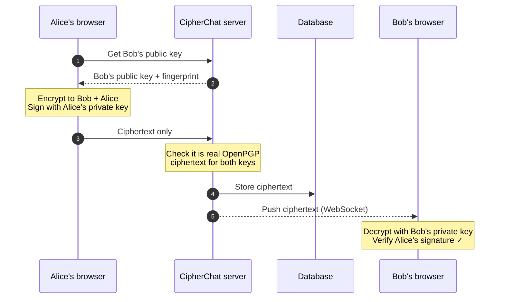
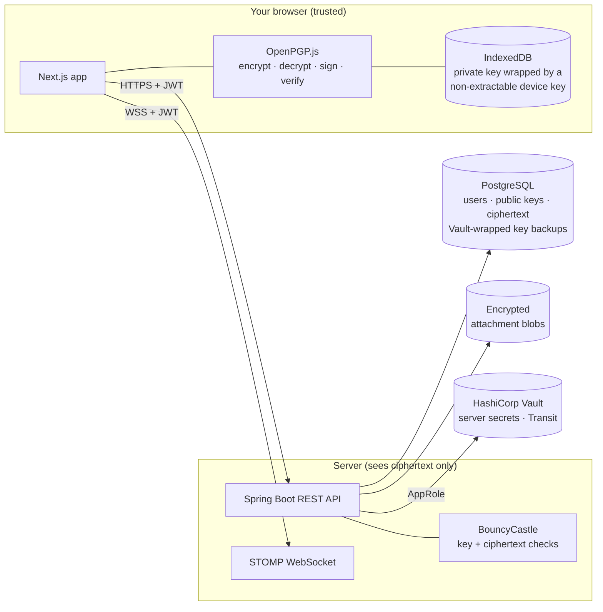
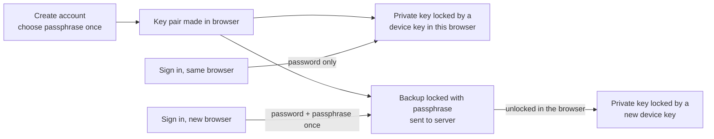

# CipherChat

**A private chat app where only you and the person you are talking to can read your messages. Not even the server that delivers them.**


---

## What it does, in plain language

CipherChat is a messaging app, like WhatsApp or Signal, built around one promise: **your messages are locked on your own device before they leave it, and they are only unlocked on the recipient's device.** Everything in between, including the internet, our server and our database, only ever sees scrambled text.

This is called **end-to-end encryption**. It matters because:

- **Servers get hacked.** If someone breaks into our database, they find only unreadable gibberish.
- **Insiders can be curious.** The people running the server cannot read your conversations either.
- **Networks can be watched.** Anyone listening in on your Wi-Fi sees nothing useful.

### The padlock analogy

Every user has a matching **padlock** and **key**:

| | In CipherChat | Who has it |
|---|---|---|
| 🔓 **Padlock** (public key) | Anyone can use it to *lock* a box addressed to you. | You hand out copies freely. The server keeps one so others can find it. |
| 🔑 **Key** (private key) | The only thing that can *open* those boxes. | **Only you**, on your own devices. The server keeps only a copy locked with your passphrase, which it cannot open. |

When Alice writes to Bob, she puts the message in a box and snaps **Bob's padlock** shut on it. From that moment, only Bob's key can open it. Alice also snaps on a copy of **her own padlock**, so she can re-read what she sent.

Alice also adds her **signature** (a wax seal only she can make). When Bob opens the box, his app checks the seal. If it matches Alice, he sees **✓ Verified**. If someone tampered with the message or pretended to be Alice, he sees **⚠ Signature invalid**.

### How do I know the padlock really belongs to Bob?

Each padlock has a unique **fingerprint**, a 40-character code like `D04A 5925 0341 9EDA …`. You can compare it with Bob in person or on a call. If they match, you know nobody (not even our server) swapped Bob's padlock for a fake one. CipherChat also remembers each contact's fingerprint and **warns you loudly if it ever changes**.

---

## What happens when you send a message

1. **You type a message** (and optionally attach a file up to 10 MB).
2. **Your browser fetches Bob's padlock** (public key) from the server and checks it against the fingerprint it remembered last time.
3. **Your browser locks the message** with Bob's padlock *and* your own, and **signs** it with your private key. This happens entirely on your device.
4. **Only the locked box (ciphertext) is sent** to the server. The server double-checks that it really is locked for both of you, and refuses anything that looks like plain text.
5. **The server stores the locked box** and instantly **pushes it to Bob** over a live connection.
6. **Bob's browser unlocks it** with his private key (kept safely on his device) and **checks your signature**, showing ✓ Verified.

Files work the same way: they are encrypted in your browser before upload, and decrypted in Bob's browser after download. Even the file's **name and type** are hidden inside the encrypted message.



### Architecture at a glance



---

## Signing up and signing in

You choose **two different secrets** when you create an account:

| | What it is for | Who sees it |
|---|---|---|
| **Password** | Proves to the server that you are you. | Sent to the server at login (stored only as a BCrypt hash). |
| **Key passphrase** | Locks the backup of your private key. | **Never leaves your browser.** Nobody can reset it, including us. |

**Create an account (once).** Your browser makes your key pair. It then makes a **backup** of the private key locked with your passphrase, and sends the server only your public key and that locked backup. On your device, the private key is kept in the browser's storage, locked by a **device key** that the browser itself guards and never lets anyone read or copy out, not even CipherChat's own code.

**Sign in on the same browser.** Username and password, that is all. The device key unlocks your private key automatically. Reloading the page does not ask for anything either.

**Sign in on a new device or browser.** After your password, the app asks for your **key passphrase once**. It downloads your locked backup, unlocks it in the browser, and protects it with a new device key. From then on, that browser also needs only your password.

**Signing out** keeps your key on that browser, so the next sign-in is quick. On a shared computer, choose **"Sign out and forget this device"**: the key is deleted from that browser, and the next sign-in there asks for the passphrase again.

> **If you lose your passphrase**, every device you are already signed in on keeps working. But on a new device there is no way back in to your old messages: the server only holds a locked backup it cannot open. That is the price of nobody else being able to read them.



### HashiCorp Vault: the server's safe

[Vault](https://developer.hashicorp.com/vault) is a dedicated "safe" for secrets. CipherChat uses it for the **server's own** secrets, not for users' keys:

- **The server's passwords live in Vault**, not in files: the secret used to sign login tokens and the database password. The server logs in to Vault when it starts and is allowed to read only those values.
- **A second lock on key backups.** Before a passphrase-locked backup is saved in the database, Vault's **Transit** feature locks it again with a key that never leaves Vault. Someone who steals a copy of the database gets nothing useful without also breaking into Vault.

Why not keep users' private keys in Vault? Because Vault belongs to whoever runs the server. A key the server can unlock is a key the server could use, and the promise is that **only you** can read your messages. More detail: [docs/KEY_MANAGEMENT.md](docs/KEY_MANAGEMENT.md).

---

## Screenshots

| Register (key created on your device) | Profile (fingerprint, key backup, this device) |
|---|---|
|  |  |

| New browser: wrong passphrase | Mobile |
|---|---|
|  |  |

---

## Technologies used, and why

| Technology | What it does here | Why we chose it |
|---|---|---|
| **OpenPGP** (the standard) | The "padlock and key" system used for all encryption and signatures. | A decades-old, openly reviewed standard (RFC 4880 / RFC 9580). Keys can be exported and used in other PGP tools such as GnuPG. |
| **Curve25519 / Ed25519** | The specific maths behind each key pair. | Modern, fast, small keys, and designed to be hard to get wrong. |
| **OpenPGP.js** | Does all encryption, decryption, signing and verification **inside your browser**. | The most widely used, independently audited OpenPGP library for JavaScript. |
| **WebCrypto** (non-extractable AES-GCM key) | Creates the "device key" that locks your private key in this browser, so you do not type your passphrase at every sign-in. | Built into every browser. The key can be used but never read or exported, even by our own code. |
| **IndexedDB** | Stores the device key and your locked private key in your browser. | Built into every modern browser; keeps the key on your device only. |
| **Next.js** (React) | Builds the web pages you interact with. | Popular, well supported, and lets us set strict security headers per request. |
| **TypeScript** | JavaScript with type checking. | Catches mistakes before they reach users. |
| **Tailwind CSS** | Styling (the calm dark look). | Consistent design with very little custom CSS. |
| **STOMP over WebSocket** (`@stomp/stompjs`) | Keeps a live connection open so new messages appear instantly. | A simple, standard messaging protocol that Spring supports natively. |
| **Spring Boot 3** (Java 21) | The server: accounts, public key directory, storing and relaying ciphertext. | Mature and secure by default, and widely used in industry. |
| **Spring Security** | Login protection, access rules, security headers, CORS. | The standard, battle-tested security layer for Java web apps. |
| **BCrypt** | Scrambles account passwords before storing them. | Deliberately slow, so stolen password hashes are very hard to crack. |
| **JWT** (jjwt) | A signed "entry pass" your browser shows on each request after login. | Stateless and simple, and works for both normal requests and the live connection. |
| **BouncyCastle** | Lets the server **check** public keys (well-formed, not expired, not a private key by mistake) and confirm messages really are encrypted. It never decrypts anything. | The reference cryptography library for Java, with full OpenPGP support. |
| **HashiCorp Vault** | The server's safe: holds the login-token secret and database password, and adds a second lock (Transit) to the stored key backups. | The industry standard for secrets. Keys never leave it, access is limited by policy and fully audited, and keys can be rotated without downtime. |
| **Spring Cloud Vault** | Lets the Spring Boot server log in to Vault and read its secrets at start-up. | The official Spring integration, so secrets never sit in config files. |
| **PostgreSQL** | Database for users, public keys, conversations and ciphertext. | Reliable, open source, and the industry standard. |
| **Flyway** | Versioned database setup scripts. | Every environment gets exactly the same database structure. |
| **H2** | An in-memory database used only by automated tests. | Tests run fast without needing a real database server. |
| **JUnit 5, MockMvc, Playwright** | Automated tests for the server and a full browser test of the real flow. | They prove encryption, verification and access rules actually work. |
| **Testcontainers** | Starts a real Vault in Docker during the server tests. | Tests the real Vault setup instead of a fake. |
| **springdoc-openapi (Swagger UI)** | Interactive API documentation in the browser. | Lets reviewers try every endpoint without writing code. |
| **Docker & Docker Compose** | Packages the database, Vault, server and website to start with one command. | "Works on my machine" becomes "works on every machine". |

---

## Running the project

### Prerequisites

| To run with Docker (easiest) | To run manually |
|---|---|
| [Docker Desktop](https://www.docker.com/products/docker-desktop/) or Docker Engine with Compose v2 | **Java 21** (JDK) · **Node.js 22+** and npm · **PostgreSQL 15+** (or use Docker just for the database) |

A modern browser (Chrome, Firefox, Edge or Safari) is needed to use the app.

### Option A: Docker Compose (one command)

From the project folder:

```bash
cp .env.example .env    # then replace each "replace-with-…" value with a random one (openssl rand -hex 24)
docker compose up --build
```

The first build takes a few minutes. It starts five services: the database, **Vault** (in development mode), a one-off `vault-init` job that puts the server's secrets into Vault, the server and the website. When it is ready, open:

| What | URL |
|---|---|
| **The app** | <http://localhost:3000> |
| API | <http://localhost:8080> |
| Swagger UI (API explorer) | <http://localhost:8080/swagger-ui.html> |
| Vault UI (development only) | <http://localhost:8200> (sign in with `VAULT_DEV_ROOT_TOKEN` from `.env`) |

> The Vault in `docker-compose.yml` runs in **development mode** (in memory, already unlocked): it is for your own computer only. There is no `JWT_SECRET` to set any more: Vault generates it. Running Vault for real is described in [DEPLOYMENT_AND_SUGGESTIONS.md](DEPLOYMENT_AND_SUGGESTIONS.md#6-running-vault-in-production).

To stop: `Ctrl+C`, then `docker compose down` (add `-v` to also delete the database and attachments).

### Option B: run backend and frontend manually

**1. Start the database and Vault** in Docker (Vault is required: the server reads its secrets from it):

```bash
cp .env.example .env    # if you have not already; fill in random values
docker compose up -d db vault vault-init
```

The database listens on `127.0.0.1:5433` (so it does not clash with a PostgreSQL already installed on your machine) and Vault on `127.0.0.1:8200`.

**2. Start the backend** (terminal 1). The database tables are created automatically on first start.

```bash
cd backend
./mvnw spring-boot:run
```

`spring-boot:run` activates the `local` profile ([`application-local.yml`](backend/src/main/resources/application-local.yml)). The server reads its Vault login from the `.env` file, then gets the database password and token secret from Vault. No environment variables are needed.

> After a reboot, run `docker compose up -d db vault vault-init` again before starting the backend.

The API runs on <http://localhost:8080> and Swagger UI on <http://localhost:8080/swagger-ui.html>. To run the packaged jar yourself, see [`backend/.env.example`](backend/.env.example).

**3. Start the frontend** (terminal 2):

```bash
cd frontend
npm install
npm run dev
```

Open <http://localhost:3000>. If the backend is not on `localhost:8080`, set `API_URL` first (see [`frontend/.env.example`](frontend/.env.example)).

### Running the tests

```bash
cd backend && ./mvnw verify           # 63 unit + integration tests (auth, users, keys, key backups, Vault, messages, attachments, WebSocket); needs Docker for Vault
cd frontend && npm run lint && npm run build
# Full browser test against the running stack (needs Google Chrome); safe to repeat:
cd frontend && npm run test:e2e
```

---

## Using the app

1. **Create an account.** Pick a username, a password (to sign in) and a separate **key passphrase**. Write the passphrase down somewhere safe: you will only be asked for it again on a new device.
2. **Search for a user** on the Chats page and start writing.
3. **Verify fingerprints** with your contact (Chat → "Key fingerprint") and mark them as verified.
4. **Next time**, sign in with your username and password only.
5. **On a new device or browser**, sign in and enter your key passphrase once when asked.
6. *(Optional)* **Export a backup file** from the Profile page to keep offline. It is locked with your passphrase and also works with GnuPG.

### Starting over with an empty database (development)

`scripts/reset-dev-data.sh` deletes every user, key, conversation, message and attachment from the **local Docker** database (it cannot touch anything else). Afterwards, clear the site data for `http://localhost:3000` in your browser (DevTools → Application → *Clear site data*), so old keys are removed from the browser too.

---

## More documentation

- [API_TESTING.md](API_TESTING.md): every endpoint with `curl` examples and expected responses, plus a Postman collection.
- [DEPLOYMENT_AND_SUGGESTIONS.md](DEPLOYMENT_AND_SUGGESTIONS.md): how to deploy (including Vault in production), and security features worth adding next.
- [docs/KEY_MANAGEMENT.md](docs/KEY_MANAGEMENT.md): how private keys and secrets are protected, and why.
