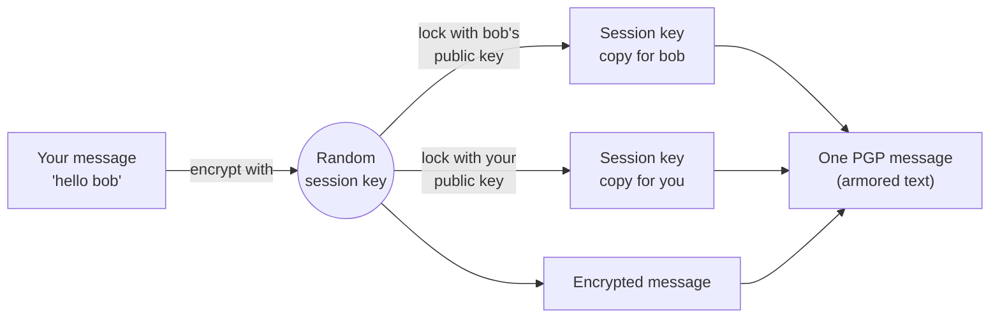

# Learn PGP from the beginning, Part II: How PGP actually protects a message

<SeriesNav course="/cybersecurity/pgp-from-the-beginning/" />

I assume nothing, except that you've read [Part I](./part-1). You know what a public key and a private key are. Now let's see how PGP uses them to protect a real message in CipherChat.

## Resources

- [OpenPGP.js: `encrypt`](https://docs.openpgpjs.org/global.html#encrypt) and [`decrypt`](https://docs.openpgpjs.org/global.html#decrypt): the two functions CipherChat calls.
- [RFC 9580, the OpenPGP standard](https://www.rfc-editor.org/rfc/rfc9580): sections 5.1 (session key packets) and 5.2 (signatures).
- [BouncyCastle Java](https://www.bouncycastle.org/documentation/): used by the server to read PGP packets.
- [Spring Boot reference](https://docs.spring.io/spring-boot/).

## In this article we will cover

- **Hybrid encryption.** How PGP locks a message with a random key, then locks that key with the recipient's public key.
- **Digital signatures and hashing.** How the "Verified" badge proves who sent a message, and what happens when a message is tampered with.
- **Fingerprints.** A short code that proves a public key is the right one.
- **Passphrases.** How your private key is protected, and why it never leaves your browser.
- **What PGP and OpenPGP are.** A little history, the standard, armored text, and why CipherChat uses Curve25519 instead of RSA.

[[toc]]

## Hybrid encryption: a random session key + the recipient's public key

### The idea in one sentence

PGP locks your message with a brand-new random key (the **session key**), then locks that small session key with the recipient's **public key**.

### Why it's done this way

Public-key encryption is slow and only works on small pieces of data. Symmetric encryption is fast and handles any size. PGP uses each for what it's good at:

- **Symmetric** (fast) for the message itself.
- **Asymmetric** (solves the sharing problem) for the session key.

That's why it's called **hybrid**.

### Where you see it in CipherChat

**Journey step 6: sending an encrypted message.** You type a message to another user and click **Send**. While the button says **Encrypting…**, your browser:

1. Creates a random session key.
2. Encrypts your message with it.
3. Encrypts the session key **twice**: once with the recipient's public key, and once with **your own** public key.

Why your own? So you can re-read your own sent messages later. The server enforces this.



### A simple comparison

You put the letter in a strongbox with a combination lock (the session key). Then you write the combination on two slips of paper. You lock one slip in bob's padlock, and one in yours. You send all three.

### Proof

The browser encrypts to **both** keys, and signs, in one call ([`crypto.ts` lines 72–84](https://github.com/angelabs-png/cipherchat/blob/0033149090aa01b53d9ccd7ccadaf8929bfe4974/frontend/src/lib/crypto.ts#L72-L84)):

```ts:line-numbers=72
/** Encrypts to recipient AND sender (so the sender can re-read their history) and signs. */
export async function encryptEnvelope(
  envelope: MessageEnvelope,
  recipientPublicKey: string,
  senderPublicKey: string,
  signingKey: UnlockedKey,
): Promise<string> {
  return openpgp.encrypt({
    message: await openpgp.createMessage({ text: JSON.stringify(envelope) }),
    encryptionKeys: await readKeys([recipientPublicKey, senderPublicKey]),
    signingKeys: signingKey,
  });
}
```

Let's break it down:

- **`JSON.stringify(envelope)`**: the message text (and file details, if any) turned into one string.
- **`encryptionKeys: [recipientPublicKey, senderPublicKey]`**: two public keys. OpenPGP.js generates the random session key itself, encrypts the message once, and locks the session key once per public key.
- **`signingKeys: signingKey`**: your unlocked private key signs the message (next section).
- **Returns**: armored text starting with `-----BEGIN PGP MESSAGE-----`.

> **Note:** The CipherChat code never creates the session key itself. OpenPGP.js does it inside `openpgp.encrypt`, as the standard requires. When I tested a real CipherChat message, it contained two "session key" packets (one per public key) and one encrypted data packet.

The server can't decrypt anything, but it *can* read who the session key was locked for. It uses BouncyCastle to read those packet headers ([`OpenPgpInspector.java` lines 138–146](https://github.com/angelabs-png/cipherchat/blob/0033149090aa01b53d9ccd7ccadaf8929bfe4974/backend/src/main/java/com/cipherchat/service/OpenPgpInspector.java#L138-L146)):

```java:line-numbers=138
            if (!(first instanceof PGPEncryptedDataList list) || list.isEmpty()) {
                throw new InvalidPgpDataException("Content must be an OpenPGP encrypted message");
            }
            Set<Long> recipients = new HashSet<>();
            for (Object entry : list) {
                if (entry instanceof PGPPublicKeyEncryptedData pked) {
                    recipients.add(pked.getKeyID());
                }
            }
```

Let's break it down:

- **`PGPEncryptedDataList`**: the list of locked session-key copies at the start of the message. If it's missing, this isn't an encrypted message, so it's rejected.
- **`PGPPublicKeyEncryptedData`**: one locked copy of the session key.
- **`pked.getKeyID()`**: the ID of the public key that copy is locked for. The server collects these IDs, but it can't open any of them.

Then the server checks that one of those IDs is bob's key, and one is yours ([`PublicKeyService.java` lines 53–67](https://github.com/angelabs-png/cipherchat/blob/0033149090aa01b53d9ccd7ccadaf8929bfe4974/backend/src/main/java/com/cipherchat/service/PublicKeyService.java#L53-L67)):

```java:line-numbers=60
        Set<Long> recipientKeys = inspector.inspectPublicKey(recipient.getPublicKey()).encryptionKeyIds();
        Set<Long> senderKeys = inspector.inspectPublicKey(sender.getPublicKey()).encryptionKeyIds();
        if (Collections.disjoint(recipientKeyIds, recipientKeys)) {
            throw ApiException.badRequest("Message is not encrypted to the recipient's current public key");
        }
        if (Collections.disjoint(recipientKeyIds, senderKeys)) {
            throw ApiException.badRequest("Message must also be encrypted to your own public key");
        }
```

Let's break it down:

- **`recipientKeys` / `senderKeys`**: the encryption key IDs inside bob's and your stored public keys.
- **`Collections.disjoint(a, b)`**: true when the two sets share nothing.
- **First `if`**: if no session-key copy is for bob's key, bob couldn't read it, so it's rejected.
- **Second `if`**: if no copy is for your key, you couldn't read your own history, so it's rejected too.

### Check yourself

1. Why doesn't PGP just encrypt the whole message with the recipient's public key?

::: details Answer
Public-key encryption is slow and only suits small data. PGP encrypts the message with a fast random session key, and only uses the public key to lock that small session key.
:::

2. A CipherChat message is encrypted to bob only, not to the sender. What does the server do?

::: details Answer
It rejects it with `400 Bad Request`: "Message must also be encrypted to your own public key". It checks this in `PublicKeyService.requireAddressedToBoth`.
:::

## Digital signatures and hashing: the "Verified" badge

### The idea in one sentence

A **digital signature** is made with the sender's **private** key and checked with their **public** key, proving who sent the message and that it wasn't changed.

### What hashing has to do with it

A **hash** is a short fingerprint of some data. Change one letter of the data, and the hash changes completely. You can't work backwards from a hash to the data.

When your browser signs a message, it hashes the message and signs that hash with your private key. The receiver hashes the message they got, and checks the signature against your public key. If anything changed, the check fails.

### Where you see it in CipherChat

**Journey step 7: receiving and decrypting.** When bob opens the chat, each message shows a small **✓ Verified** badge next to the time.


The badge can show three things:

| Badge | What it means |
| --- | --- |
| **✓ Verified** | Signed by the sender's current public key, and not changed. |
| **Signature invalid** | Signed, but not by the key CipherChat has for that sender. |
| **Unsigned** | No signature at all. |

**Journey step 10: a tampered message.** What if someone changes the ciphertext in the database? I tested this with the exact OpenPGP.js version CipherChat uses:

- **Changed encrypted bytes:** decryption fails with *"Modification detected"*. OpenPGP's built-in integrity check catches it before the signature is even checked. CipherChat then shows, in red, *"This message could not be decrypted with your key."*
- **Signed by a different key** (someone pretending to be the sender): the message decrypts, but shows **Signature invalid** in red.

> **Warning:** For attachments, CipherChat asks *"This file's signature could not be verified. Download anyway?"* before saving a file that isn't verified.

### A simple comparison

A wax seal on an envelope. Only the sender has the stamp (private key), but anyone can check the seal (public key). A broken seal means someone opened it.

### Proof

When decrypting, CipherChat checks the signature against **only** the claimed sender's public key ([`crypto.ts` lines 86–117](https://github.com/angelabs-png/cipherchat/blob/0033149090aa01b53d9ccd7ccadaf8929bfe4974/frontend/src/lib/crypto.ts#L86-L117)):

```ts:line-numbers=86
async function signatureStatus(signatures: { verified: Promise<unknown> }[]): Promise<SignatureStatus> {
  if (signatures.length === 0) return "unsigned";
  try {
    await signatures[0].verified;
    return "verified";
  } catch {
    return "invalid";
  }
}
```

Let's break it down:

- **`signatures.length === 0`**: no signature at all, so the result is `"unsigned"`.
- **`await signatures[0].verified`**: OpenPGP.js re-hashes the message and checks the signature with the sender's public key. It throws if the check fails.
- **`"verified"` / `"invalid"`**: this value becomes the badge you see.

And here's where only the sender's key is trusted for checking ([`crypto.ts` lines 107–111](https://github.com/angelabs-png/cipherchat/blob/0033149090aa01b53d9ccd7ccadaf8929bfe4974/frontend/src/lib/crypto.ts#L107-L111)):

```ts:line-numbers=107
  const { data, signatures } = await openpgp.decrypt({
    message: await openpgp.readMessage({ armoredMessage }),
    decryptionKeys: decryptionKey,
    verificationKeys: await readKeys([senderPublicKey]),
  });
```

Let's break it down:

- **`decryptionKeys: decryptionKey`**: your unlocked private key opens your copy of the session key, then the message.
- **`verificationKeys: [senderPublicKey]`**: only the sender's public key may confirm the signature. A message signed by anyone else shows "Signature invalid".

If decryption itself fails (for example, a tampered message), the chat screen catches it ([`chats/[username]/page.tsx` lines 61–66](https://github.com/angelabs-png/cipherchat/blob/0033149090aa01b53d9ccd7ccadaf8929bfe4974/frontend/src/app/%28app%29/chats/%5Busername%5D/page.tsx#L61-L66)):

```tsx:line-numbers=61
      try {
        const { envelope, signature } = await decryptEnvelope(m.ciphertext, privateKey!, senderKey);
        return { id: m.id, sender: m.sender, createdAt: m.createdAt, envelope, signature };
      } catch {
        return { id: m.id, sender: m.sender, createdAt: m.createdAt, failed: true };
      }
```

Let's break it down:

- **`decryptEnvelope(...)`**: decrypts and checks the signature.
- **`signature`**: saved with the message, and shown as the badge.
- **`failed: true`**: if anything throws, the message is marked failed, and the screen shows "This message could not be decrypted with your key." instead of any text.

### Check yourself

1. Which key signs a message, and which key checks the signature?

::: details Answer
The sender's **private** key signs it. The receiver checks it with the sender's **public** key.
:::

2. Someone edits a message's ciphertext in the database. What does the receiver see in CipherChat?

::: details Answer
The integrity check fails ("Modification detected"), so decryption throws, and the message shows in red: "This message could not be decrypted with your key." The tampered text is never shown.
:::

## Fingerprints: is this really their key?

### The idea in one sentence

A **fingerprint** is a hash of a public key, a short code you can compare to make sure you have the right key.

### Why it matters

Encryption is only as good as the public key you use. If the server (or an attacker) swapped bob's public key for their own, you'd be encrypting for the wrong person. Comparing fingerprints catches that.

### Where you see it in CipherChat

**Journey step 5: finding another user and viewing their fingerprint.**

1. On **Chats**, type part of a username in **Start a conversation**. Matching users appear. Users without a key show "no key yet".
2. Click a user to open the chat.
3. Click **Key fingerprint** at the top right. You'll see their fingerprint in groups of four, like `5B6B 6AC6 EA1C 397B ...`
4. Compare it with the fingerprint they see on their own **Profile** page, in person or over a call. If they match, click **Fingerprints match — mark verified**. A small "verified key" label then appears next to their name.


CipherChat also remembers the first fingerprint it sees for each contact. This is called **trust on first use**. If the key ever changes, sending is blocked and you see *"bob's key has changed"*, with the old and new fingerprints side by side.

### A simple comparison

Checking the number plate of a taxi against the one in your booking app. If the plate matches, it's the right car.

### Proof

The browser calculates the fingerprint itself, and never trusts the server's number ([`peers.ts` lines 21–34](https://github.com/angelabs-png/cipherchat/blob/0033149090aa01b53d9ccd7ccadaf8929bfe4974/frontend/src/lib/peers.ts#L21-L34)):

```ts:line-numbers=21
export async function loadPeerKey(api: Api, owner: string, peer: string): Promise<PeerKey> {
  const { publicKey } = await api.getKey(peer);
  const fingerprint = await fingerprintOf(publicKey);
  const pinned = await contacts.get(owner, peer);

  if (!pinned) {
    await contacts.put(owner, peer, fingerprint, false);
    return { username: peer, publicKey, fingerprint, trust: "new" };
  }
  if (pinned.fingerprint !== fingerprint) {
    return { username: peer, publicKey, fingerprint, pinnedFingerprint: pinned.fingerprint, trust: "changed" };
  }
  return { username: peer, publicKey, fingerprint, trust: pinned.verified ? "verified" : "known" };
}
```

Let's break it down:

- **`api.getKey(peer)`**: downloads the contact's public key from the server (`GET /api/keys/{username}`).
- **`fingerprintOf(publicKey)`**: calculates the fingerprint from the key itself, in the browser.
- **`contacts.get(owner, peer)`**: looks up the fingerprint pinned on this device before.
- **`!pinned`**: first time, so pin it (`trust: "new"`).
- **`pinned.fingerprint !== fingerprint`**: the key changed, so `trust: "changed"`, and the chat blocks sending until you confirm.

The server calculates the same fingerprint with BouncyCastle when a key is uploaded ([`OpenPgpInspector.java` line 119](https://github.com/angelabs-png/cipherchat/blob/0033149090aa01b53d9ccd7ccadaf8929bfe4974/backend/src/main/java/com/cipherchat/service/OpenPgpInspector.java#L119)):

```java:line-numbers=119
                Hex.toHexString(primary.getFingerprint()).toUpperCase(),
```

Let's break it down:

- **`primary.getFingerprint()`**: BouncyCastle hashes the primary public key.
- **`Hex.toHexString(...).toUpperCase()`**: turns it into 40 uppercase hex characters, like the ones on screen.

> **Note:** CipherChat's keys are OpenPGP "version 4" keys, whose fingerprint is a SHA-1 hash, 40 hex characters long. The newer RFC 9580 "version 6" keys use SHA-256.

### Check yourself

1. Why does CipherChat compute the fingerprint in the browser instead of using the one the server sends?

::: details Answer
Because the server might be compromised. If it swapped bob's key, it could also lie about the fingerprint. Computing it locally from the key itself means the number you compare is honest.
:::

2. You open a chat and see "bob's key has changed". What should you do?

::: details Answer
Don't send anything yet. Contact bob another way (in person or a call) and compare the new fingerprint. Only then click "I have verified it — use the new key".
:::

## Protecting the private key: passphrases

### The idea in one sentence

Your private key is stored **locked** with your passphrase, is only unlocked in your browser's memory, and is never sent to the server.

### Where you see it in CipherChat

**Journey step 4: logging in and unlocking the private key.** The **Sign in** screen asks for three things: **Username**, **Password** and **Key passphrase**. The hint says *"Unlocks your private key on this device only."*

1. Username and password go to the server, which answers with a login token.
2. The passphrase **stays in the browser**. It unlocks the locked private key stored there.

If you reload the page, the unlocked key is gone. You'll see **Unlock your key**: *"Your private key is locked after a reload."* Enter the passphrase again, and you're back.

**Journey step 9: exporting a key backup.** On **Profile**, **Export private key backup** downloads a `.asc` file. It's the **locked** private key, *"Encrypted with your passphrase"*. You need it to sign in on another device.

### A simple comparison

A safe in your bedroom. The safe (the locked private key) can be stored anywhere. The combination (the passphrase) is only in your head.

### Proof

The session keeps the unlocked key in memory only, and saves just the token and username ([`session.ts` lines 38–50](https://github.com/angelabs-png/cipherchat/blob/0033149090aa01b53d9ccd7ccadaf8929bfe4974/frontend/src/lib/session.ts#L38-L50)):

```ts:line-numbers=38
function emit(next: SessionState) {
  state = next;
  try {
    if (next.token) {
      sessionStorage.setItem(STORAGE_KEY, JSON.stringify({ token: next.token, username: next.username }));
    } else {
      sessionStorage.removeItem(STORAGE_KEY);
    }
  } catch {
    // Keep working in memory.
  }
  listeners.forEach((listener) => listener());
}
```

Let's break it down:

- **`state = next`**: the full session, including `privateKey`, lives in a JavaScript variable (memory).
- **`sessionStorage.setItem(... { token, username })`**: only the token and username are saved. The private key isn't. That's why a reload asks for your passphrase again.

At sign-in, the stored key is first compared to the key the server has for you, then unlocked ([`login/page.tsx` lines 41–51](https://github.com/angelabs-png/cipherchat/blob/0033149090aa01b53d9ccd7ccadaf8929bfe4974/frontend/src/app/%28auth%29/login/page.tsx#L41-L51)):

```tsx:line-numbers=41
  async function unlockStored(username: string, passphrase: string, serverFingerprint?: string | null) {
    const stored = await keystore.get(username);
    if (!stored) return null;
    if (serverFingerprint && stored.fingerprint !== serverFingerprint) {
      throw new Error(
        "The key stored on this device does not match the key on your account. Import your current key backup.",
      );
    }
    const key = await unlockPrivateKey(stored.encryptedPrivateKey, passphrase);
    return { key, stored };
  }
```

Let's break it down:

- **`keystore.get(username)`**: reads the locked key from IndexedDB on this device.
- **`!stored`**: no key on this device (a new computer). The screen then asks you to import your backup file.
- **`stored.fingerprint !== serverFingerprint`**: the key on this device isn't the one on your account, so stop.
- **`unlockPrivateKey(..., passphrase)`**: unlocks it in memory. A wrong passphrase shows "Wrong passphrase. Your key could not be unlocked."

### Check yourself

1. You reload the CipherChat tab. Why are you asked for your passphrase but not your password?

::: details Answer
The login token is kept in `sessionStorage`, so you're still signed in to the server. But the unlocked private key only lived in memory, so it's gone after a reload and must be unlocked again with the passphrase.
:::

2. What's inside the file from "Export private key backup"? Is it dangerous to lose?

::: details Answer
It's your private key, still **locked** with your passphrase. Someone who finds it would also need your passphrase. But keep them separate, as the app says: the file and the passphrase together unlock everything.
:::

## What PGP and OpenPGP actually are

### The idea in one sentence

**PGP** ("Pretty Good Privacy") is a way to encrypt and sign data, and **OpenPGP** is the open standard that describes it, so different programs can work together.

### History in three lines

- **1991:** Phil Zimmermann releases PGP so ordinary people can encrypt email.
- **1998:** The format becomes an open internet standard, **OpenPGP** (RFC 2440, later RFC 4880).
- **2024:** **RFC 9580** updates the standard with modern algorithms. OpenPGP.js and BouncyCastle both follow it.

### Armored text

PGP data is binary, but binary is awkward in JSON and text fields. **ASCII armor** wraps it in plain text: a header line, base64 text, and a footer. That's what CipherChat sends and stores:

```text
-----BEGIN PGP MESSAGE-----

wV4D9v78+ubzcX8SAQdA/uZ1cLp0nzgBqlDPSrrq59QUCZTl5jbWEDYTe2kc
...
-----END PGP MESSAGE-----
```

Let's break it down:

- **`-----BEGIN PGP MESSAGE-----`**: says what's inside. Public keys start with `-----BEGIN PGP PUBLIC KEY BLOCK-----`.
- **The base64 lines**: the binary packets (session-key copies, then the encrypted data), written as letters and numbers.
- **`-----END PGP MESSAGE-----`**: the end.

> **Note:** Attachments are the exception. CipherChat encrypts files in **binary** format (`format: "binary"`), because armor makes files about a third bigger.

### Curve25519 vs RSA

There are two main families of public-key maths:

| | **RSA** | **ECC (Curve25519)** |
| --- | --- | --- |
| Age | 1977 | 2005 onwards |
| Key size for strong security | 3072+ bits | 256 bits |
| Key generation in a browser | Slow (seconds) | Fast (milliseconds) |
| Used by CipherChat | Accepted if uploaded (2048+ bits) | **Generated for every new account** |

CipherChat generates an ECC key: **Ed25519** for signing, and **X25519** (Curve25519) for encryption. Your Profile shows it as `EdDSA/Ed25519 + ECDH/Curve25519`.

### Proof

The key type is set when generating ([`crypto.ts` lines 26–27](https://github.com/angelabs-png/cipherchat/blob/0033149090aa01b53d9ccd7ccadaf8929bfe4974/frontend/src/lib/crypto.ts#L26-L27)):

```ts:line-numbers=26
    type: "ecc",
    curve: "curve25519Legacy", // Ed25519 signing + X25519 (ECDH) encryption subkey
```

Let's break it down:

- **`type: "ecc"`**: elliptic-curve cryptography, not RSA.
- **`curve: "curve25519Legacy"`**: OpenPGP.js's name for the widely supported version 4 Curve25519 format. "Legacy" means the older way of writing these keys, not weak maths. It works with most PGP tools today.

The server accepts RSA too, but refuses weak keys ([`OpenPgpInspector.java` lines 231–241](https://github.com/angelabs-png/cipherchat/blob/0033149090aa01b53d9ccd7ccadaf8929bfe4974/backend/src/main/java/com/cipherchat/service/OpenPgpInspector.java#L231-L241)):

```java:line-numbers=231
    private static void rejectWeak(PGPPublicKey key) {
        int alg = key.getAlgorithm();
        boolean rsa = alg == PublicKeyAlgorithmTags.RSA_GENERAL || alg == PublicKeyAlgorithmTags.RSA_ENCRYPT
                || alg == PublicKeyAlgorithmTags.RSA_SIGN;
        if (rsa && key.getBitStrength() < MIN_RSA_BITS) {
            throw new InvalidPgpDataException("RSA keys must be at least " + MIN_RSA_BITS + " bits");
        }
        if (alg == PublicKeyAlgorithmTags.DSA || alg == PublicKeyAlgorithmTags.ELGAMAL_ENCRYPT
                || alg == PublicKeyAlgorithmTags.ELGAMAL_GENERAL) {
            throw new InvalidPgpDataException("DSA/ElGamal keys are not supported; use Curve25519 or RSA");
        }
```

Let's break it down:

- **`key.getAlgorithm()`**: which maths the key uses.
- **`MIN_RSA_BITS`**: 2048. Smaller RSA keys are rejected.
- **`DSA` / `ELGAMAL`**: old algorithms, rejected entirely.

### Check yourself

1. What's the difference between PGP and OpenPGP?

::: details Answer
PGP was the original 1991 program. OpenPGP is the open standard (now RFC 9580) that describes the format, so tools like OpenPGP.js and BouncyCastle can read each other's data.
:::

2. Why does CipherChat generate Curve25519 keys instead of RSA?

::: details Answer
ECC keys are much smaller and faster to generate for the same strength, which matters because keys are generated in the browser during registration. The server still accepts RSA keys of 2048 bits or more.
:::

## Summary

- **Hybrid encryption:** a random session key encrypts the message, and each recipient's public key locks a copy of the session key. CipherChat locks it for the recipient **and** the sender, and the server checks both.
- **Signatures** prove who sent a message. CipherChat checks against the sender's key only, and shows Verified, Signature invalid or Unsigned. A tampered message fails to decrypt at all.
- **Fingerprints** let two people confirm they have the right key. CipherChat calculates them in the browser and warns when a contact's key changes.
- **Passphrases** keep the private key locked on your device. It's unlocked in memory only and never sent to the server.
- **OpenPGP** (RFC 9580) is the standard behind all of this. CipherChat uses armored text for messages and Curve25519 keys.

**Next:** [Part III: PGP inside CipherChat, end to end](./part-3)
