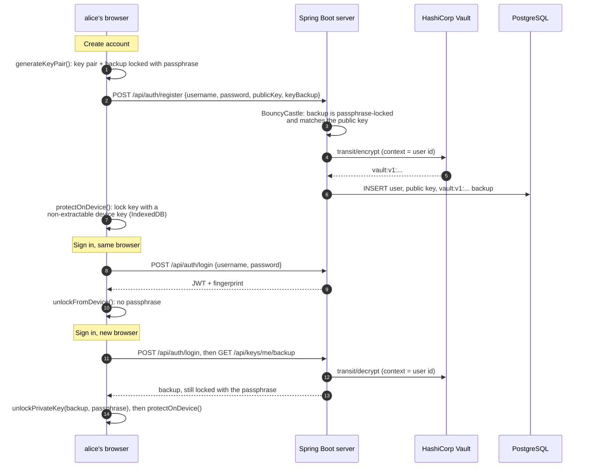
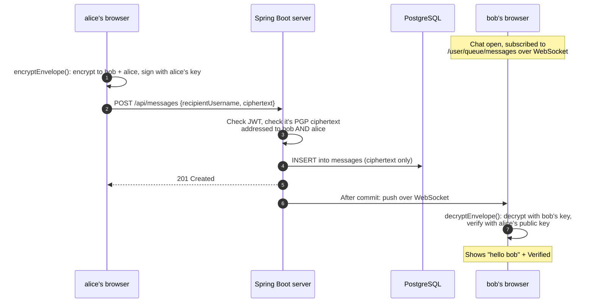
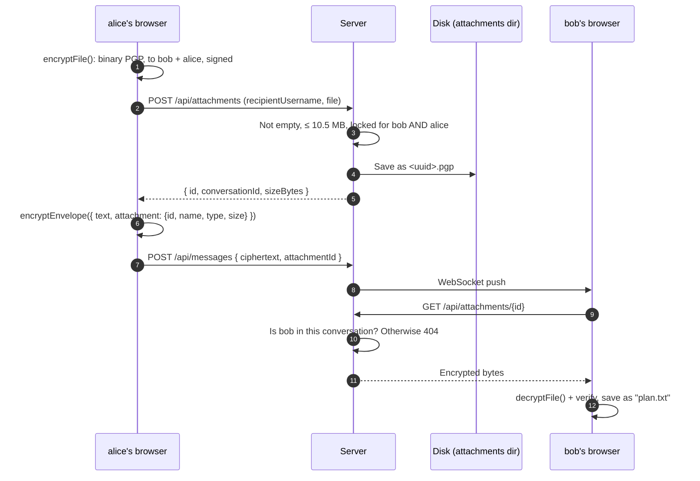

# Learn PGP from the beginning, Part III: PGP inside CipherChat, end to end

<SeriesNav course="/cybersecurity/pgp-from-the-beginning/" />

I assume nothing, except the ideas from [Part I](./part-1) and [Part II](./part-2): key pairs, session keys, signatures and fingerprints. Now we put them together and follow one real message, and one real file, all the way from alice's keyboard to bob's screen.

## Resources

- [OpenPGP.js documentation](https://docs.openpgpjs.org/)
- [RFC 9580, the OpenPGP standard](https://www.rfc-editor.org/rfc/rfc9580)
- [BouncyCastle Java](https://www.bouncycastle.org/documentation/)
- [Spring Boot reference: WebSockets](https://docs.spring.io/spring-framework/reference/web/websocket/stomp.html) (STOMP messaging)
- [Spring Boot reference](https://docs.spring.io/spring-boot/)
- [MDN: Web Crypto API](https://developer.mozilla.org/en-US/docs/Web/API/Web_Crypto_API) and [HashiCorp Vault: Transit](https://developer.hashicorp.com/vault/docs/secrets/transit)

## In this article we will cover

- **The journey of your key.** Creating an account, signing in, and setting up a new device.
- **The journey of one message.** Every step from typing to the "Verified" badge, with one diagram.
- **The journey of one attachment.** How a file is encrypted, stored and downloaded.
- **What the server can and cannot see.** Honestly, including the metadata it *does* see.
- **The libraries.** Each one, what it does, and where it's used.

[[toc]]

## The journey of your key: create account, sign in, new device

### The idea in one sentence

You type your key passphrase once when you create your account, and again only on a new device; every other sign-in uses your password alone, because each device keeps its own locked copy of your private key.

### Where you see it in CipherChat

**Journey steps 1 to 4b.**

1. **Create your account.** alice fills in **Username**, **Password**, **Key passphrase** and **Confirm passphrase**, and clicks **Create account**.
2. **Her browser makes the key pair** and a **backup** of the private key locked with her passphrase.
3. **It sends the public key and the locked backup** to the server, and locks the private key on this device with a device key.
4. **Next day, same browser:** she signs in with username and password. The device key unlocks her private key. No passphrase.
5. **New laptop (step 4b):** after the password, the app shows **Set up this browser** and asks for her key passphrase **once**. It downloads the locked backup, unlocks it in the browser, and locks it with a new device key.



### Two locks on the server copy

The backup on the server is locked **twice**:

| Lock | Who holds the key | What it protects against |
|---|---|---|
| **Inner: your passphrase** (OpenPGP, AES-256) | Only you | The server, its operators, and anyone who breaks into it |
| **Outer: Vault Transit** (AES-256-GCM, a different key per user) | HashiCorp Vault, never the database | Someone who steals a copy of the database or a database backup |

The server can remove the outer lock (it needs to, to give you your backup), but it can never remove the inner one.

### Proof

The outer lock ([`KeyBackupEnvelope.java` lines 42–51](https://github.com/angelabs-png/cipherchat/blob/4dfcc8035cb33637ab6c712c660f036e26f21db9/backend/src/main/java/com/cipherchat/service/KeyBackupEnvelope.java#L42-L51)):

```java:line-numbers=42
    public String wrap(long userId, String passphraseLockedBackup) {
        Plaintext plaintext = Plaintext.of(passphraseLockedBackup.getBytes(StandardCharsets.US_ASCII))
                .with(context(userId));
        try {
            return transit.encrypt(keyName, plaintext).getCiphertext();
        } catch (VaultException e) {
            log.error("Vault Transit encrypt failed for user {}", userId, e);
            throw new ApiException(HttpStatus.SERVICE_UNAVAILABLE, UNAVAILABLE);
        }
    }
```

Let's break it down:

- **`passphraseLockedBackup`**: what the browser sent. It is already locked with alice's passphrase.
- **`.with(context(userId))`**: the Vault key is "derived": each user gets their own key, made from their user ID. A backup copied onto another user's row can't be decrypted.
- **`transit.encrypt(keyName, plaintext)`**: Vault encrypts it and returns text like `vault:v1:buiRA3i0...`. The encryption key never leaves Vault.
- **`SERVICE_UNAVAILABLE`**: if Vault is down, the app answers `503` with a clear message instead of storing anything unprotected.

What ends up in the database is only that Vault text ([`V2__key_backup.sql` lines 1–5](https://github.com/angelabs-png/cipherchat/blob/4dfcc8035cb33637ab6c712c660f036e26f21db9/backend/src/main/resources/db/migration/V2__key_backup.sql#L1-L5)):

```sql:line-numbers=1
-- Passphrase-protected private key backup, so a user can sign in on a new device with only their
-- password and key passphrase. The browser locks the key with the passphrase before upload; the
-- server then wraps it again with Vault Transit (envelope encryption) and stores that here.
-- Neither layer gives the server a usable private key.
ALTER TABLE users ADD COLUMN key_backup VARCHAR(40000);
```

### Check yourself

1. alice signs in on her phone for the first time. What does she type?

::: details Answer
Username and password, then her key passphrase **once**, to unlock the backup on the phone. After that, the phone needs only her password.
:::

2. A thief steals a database backup. Can they get alice's private key?

::: details Answer
No. The `key_backup` column holds Vault ciphertext (`vault:v1:...`). Without access to Vault they can't remove even the outer lock. And even with Vault, they'd still face the passphrase lock.
:::

## The journey of one message

### The idea in one sentence

alice's browser encrypts and signs the message, the server checks it's valid ciphertext, stores it and pushes it to bob in real time, and bob's browser decrypts and verifies it.

### Where you see it in CipherChat

**Journey steps 6 and 7.** alice and bob both have the chat open. alice types `hello bob` and presses **Send**. Almost instantly, bob sees the message appear with **Verified**, without refreshing.



### Step by step

1. **alice's browser encrypts.** `encryptEnvelope` encrypts `{ v: 1, text: "hello bob" }` to bob's **and** alice's public keys, and signs it with alice's private key (Part II).
2. **It sends only ciphertext.** `api.sendMessage` makes `POST /api/messages` with `recipientUsername`, `ciphertext` and an optional `attachmentId`. The login token (JWT) goes in the `Authorization` header.
3. **The server checks who's calling.** `JwtAuthenticationFilter` verifies the JWT. No valid token, no entry: `401`.
4. **The server checks the content.** `MessageService.send` rejects anything over 200,000 characters. Then it finds or creates the conversation, reads the key IDs from the PGP packets with BouncyCastle, and checks the message is locked for bob and alice.
5. **It stores the ciphertext.** A new row goes into the `messages` table. The conversation's `last_message_at` is updated.
6. **It announces the new message.** `MessageService` publishes a `MessageSentEvent`. Once the database transaction is committed, `MessageRelay` pushes the message over WebSocket to bob, and to alice's other tabs.
7. **bob's browser decrypts and verifies.** `useIncomingMessages` receives it on `/user/queue/messages`. The chat decrypts it with bob's private key, checks the signature with alice's public key, and shows the text with **Verified**.

### Proof

The server side of steps 4 to 6 ([`MessageService.java` lines 53–81](https://github.com/angelabs-png/cipherchat/blob/0033149090aa01b53d9ccd7ccadaf8929bfe4974/backend/src/main/java/com/cipherchat/service/MessageService.java#L53-L81)), shortened to the key lines:

```java:line-numbers=53
    @Transactional
    public MessageResponse send(AuthUser me, SendMessageRequest request) {
        if (request.ciphertext().length() > maxCiphertextChars) {
            throw ApiException.payloadTooLarge("Message is too large");
        }
        Conversation conversation = conversationService.getOrCreate(me.id(), request.recipientUsername());
        User recipient = conversation.peerOf(me.id());
        User sender = conversation.peerOf(recipient.getId());

        publicKeyService.requireAddressedToBoth(inspector.encryptedMessageRecipients(request.ciphertext()),
                sender, recipient);
```

Let's break it down:

- **`@Transactional`**: everything in this method is saved together, or not at all.
- **`maxCiphertextChars`**: 200,000 characters (set in `application.yml`). Bigger messages get `413 Payload Too Large`.
- **`getOrCreate(...)`**: finds the one conversation between alice and bob, or creates it.
- **`encryptedMessageRecipients(...)`**: BouncyCastle reads which keys the session key was locked for (Part II).
- **`requireAddressedToBoth(...)`**: rejects the message unless it's locked for both bob and alice.

The same method then saves the message and fires the event ([lines 76–80](https://github.com/angelabs-png/cipherchat/blob/0033149090aa01b53d9ccd7ccadaf8929bfe4974/backend/src/main/java/com/cipherchat/service/MessageService.java#L76-L80)):

```java:line-numbers=76
        Message saved = messages.save(new Message(conversation, sender, request.ciphertext(), attachment));
        conversation.touch(saved.getCreatedAt());
        MessageResponse response = MessageResponse.from(saved);
        events.publishEvent(new MessageSentEvent(response, sender.getUsername(), recipient.getUsername()));
        return response;
```

Let's break it down:

- **`messages.save(new Message(...))`**: stores the ciphertext exactly as received.
- **`conversation.touch(...)`**: sets "last message at", so the chat list is sorted by recent activity.
- **`events.publishEvent(...)`**: announces the message. The WebSocket push happens in a separate class, after saving succeeds.

And here's the push ([`MessageRelay.java` lines 19–24](https://github.com/angelabs-png/cipherchat/blob/0033149090aa01b53d9ccd7ccadaf8929bfe4974/backend/src/main/java/com/cipherchat/service/MessageRelay.java#L19-L24)):

```java:line-numbers=19
    @TransactionalEventListener(phase = TransactionPhase.AFTER_COMMIT)
    public void onMessageSent(MessageService.MessageSentEvent event) {
        messaging.convertAndSendToUser(event.recipient(), StompAuthChannelInterceptor.MESSAGES_QUEUE, event.message());
        // Echo to the sender's other tabs/devices.
        messaging.convertAndSendToUser(event.sender(), StompAuthChannelInterceptor.MESSAGES_QUEUE, event.message());
    }
```

Let's break it down:

- **`AFTER_COMMIT`**: only runs once the message is safely in the database. bob never receives a message that failed to save.
- **`convertAndSendToUser(event.recipient(), "/queue/messages", ...)`**: sends the ciphertext to bob's private WebSocket queue.
- **Second call**: also sends it to alice, so her other open tabs stay in sync.

### Check yourself

1. Why does the server push the message only `AFTER_COMMIT`?

::: details Answer
So bob is never shown a message that then failed to save. The event only fires after the database transaction succeeds.
:::

2. Does the server decrypt the message to check it's valid?

::: details Answer
No. It can't: it has no private keys. It only reads the PGP packet headers (the key IDs the session key was locked for) with BouncyCastle.
:::

## The journey of one attachment

### The idea in one sentence

The file is encrypted in alice's browser and uploaded first. Its name and type travel *inside* the encrypted message, so the server only stores an unreadable blob.

### Where you see it in CipherChat

**Journey step 8: sending and downloading an encrypted attachment.**

1. alice clicks the **+** button next to the message box and chooses a file (10 MB maximum). It appears above the box, with its name, size and a **Remove** link.

   

2. She types `see attached` and clicks **Send**.
3. bob sees the message with a small file button showing a lock icon, the name `plan.txt` and its size.
4. bob clicks it. His browser downloads the encrypted blob, decrypts it, checks the signature, and saves the file with its original name.




### Proof

In the browser, the file is encrypted and uploaded before the message is written ([`chats/[username]/page.tsx` lines 130–135](https://github.com/angelabs-png/cipherchat/blob/0033149090aa01b53d9ccd7ccadaf8929bfe4974/frontend/src/app/%28app%29/chats/%5Busername%5D/page.tsx#L130-L135)):

```tsx:line-numbers=130
      if (file) {
        if (file.size > MAX_ATTACHMENT_BYTES) throw new Error("Attachments must be 10 MB or smaller");
        const encrypted = await encryptFile(new Uint8Array(await file.arrayBuffer()), peer.publicKey, myPublicKey, privateKey);
        const uploaded = await api.uploadAttachment(peer.username, encrypted);
        attachment = { id: uploaded.id, name: file.name, type: file.type, size: file.size };
      }
```

Let's break it down:

- **`MAX_ATTACHMENT_BYTES`**: 10 MB, checked before any work is done.
- **`encryptFile(...)`**: encrypts the raw bytes to bob and alice, and signs them, in binary PGP format.
- **`api.uploadAttachment(...)`**: uploads only the encrypted bytes. The server answers with an `id`.
- **`attachment = { id, name, type, size }`**: the real file name and type are put in the envelope, which is then encrypted with the message. The server never sees them.

On the server, the upload is checked and stored ([`AttachmentService.java` lines 47–68](https://github.com/angelabs-png/cipherchat/blob/0033149090aa01b53d9ccd7ccadaf8929bfe4974/backend/src/main/java/com/cipherchat/service/AttachmentService.java#L47-L68)), shortened:

```java:line-numbers=58
        Set<Long> keyIds;
        try (InputStream in = file.getInputStream()) {
            keyIds = inspector.encryptedMessageRecipients(in);
        } catch (IOException e) {
            throw new UncheckedIOException(e);
        }
        publicKeyService.requireAddressedToBoth(keyIds, sender, recipient);

        Attachment attachment = attachments.save(new Attachment(conversation, sender, file.getSize()));
        try (InputStream in = file.getInputStream()) {
            storage.store(attachment.getId(), in);
```

Let's break it down:

- **`encryptedMessageRecipients(in)`**: the same BouncyCastle check as for messages, on the binary file. An unencrypted file is rejected.
- **`requireAddressedToBoth(...)`**: the file must be locked for both people.
- **`new Attachment(conversation, sender, file.getSize())`**: the database only records which conversation, who uploaded it, and the size. No name, no type.
- **`storage.store(attachment.getId(), in)`**: writes the encrypted bytes to disk as `<uuid>.pgp`.

Downloads are for participants only ([`AttachmentService.java` lines 76–84](https://github.com/angelabs-png/cipherchat/blob/0033149090aa01b53d9ccd7ccadaf8929bfe4974/backend/src/main/java/com/cipherchat/service/AttachmentService.java#L76-L84)):

```java:line-numbers=76
    /** Participants only; everyone else gets 404 so ids cannot be probed. */
    @Transactional(readOnly = true)
    public Download download(Long userId, UUID id) {
        Attachment attachment = attachments.findById(id)
                .filter(a -> a.getConversation().hasParticipant(userId))
                .orElseThrow(() -> ApiException.notFound("Attachment not found"));
```

Let's break it down:

- **`findById(id)`**: looks up the attachment by its random UUID.
- **`.filter(... hasParticipant(userId))`**: keeps it only if the caller is alice or bob.
- **`notFound(...)`**: anyone else gets `404`, not `403`. That way, an outsider can't even tell whether the id exists.

### Check yourself

1. Where is the attachment's real file name stored?

::: details Answer
Inside the encrypted message envelope (`attachment: { id, name, type, size }`). The server's `attachments` table has no name or type column, and the file on disk is called `<uuid>.pgp`.
:::

2. carol guesses an attachment id from alice and bob's chat. What does she get?

::: details Answer
`404 Not Found`, because she isn't a participant in that conversation. Even if she got the bytes, they're encrypted to bob and alice only.
:::

## What the server can and cannot see

### The idea in one sentence

The server sees **who** talks to **whom** and **when**, but never **what** they say.

### The honest table

| The server **can** see | The server **cannot** see |
| --- | --- |
| Usernames | Message text |
| Your password when you sign in (over HTTPS), and stores only its BCrypt hash | Your key passphrase |
| Public keys, fingerprints and key algorithms | A usable private key |
| Your key backup, but only locked with your passphrase (and stored wrapped by Vault) | What's inside that backup |
| Ciphertext of every message | Attachment contents |
| Who is in each conversation | Attachment file names and types |
| When each message was sent, and when conversations were last active | Whether a message was "Verified" (that's checked in the browser) |
| Size of every message and attachment | |
| Which public keys each message is locked for | |
| Your IP address (used for login rate limiting) | |

The right-hand column is what **end-to-end encryption** protects. The left-hand column is **metadata**. CipherChat doesn't hide metadata. Someone with access to the database could build a map of who talks to whom, and how often.

> **Warning:** In an interview, say this clearly. "The server can't read messages, but it does see metadata" is a stronger answer than claiming the server knows nothing.

### Proof

The database schema itself shows what's stored ([`V1__init.sql` lines 39–46](https://github.com/angelabs-png/cipherchat/blob/0033149090aa01b53d9ccd7ccadaf8929bfe4974/backend/src/main/resources/db/migration/V1__init.sql#L39-L46)):

```sql:line-numbers=39
CREATE TABLE messages (
    id               BIGINT GENERATED BY DEFAULT AS IDENTITY PRIMARY KEY,
    conversation_id  BIGINT NOT NULL REFERENCES conversations (id),
    sender_id        BIGINT NOT NULL REFERENCES users (id),
    ciphertext       VARCHAR(200000) NOT NULL,
    attachment_id    UUID REFERENCES attachments (id),
    created_at       TIMESTAMP WITH TIME ZONE NOT NULL
);
```

Let's break it down:

- **`ciphertext`**: the only content column. There's no `text` or `body` column.
- **`conversation_id`, `sender_id`, `created_at`**: metadata. Who sent it, in which conversation, and when.
- **`attachment_id`**: links to a file, which has no name column either.

And the attachment entity says it in its own comment ([`Attachment.java` lines 14–17](https://github.com/angelabs-png/cipherchat/blob/0033149090aa01b53d9ccd7ccadaf8929bfe4974/backend/src/main/java/com/cipherchat/model/Attachment.java#L14-L17)):

```java:line-numbers=14
/**
 * Metadata for an encrypted attachment. The bytes live in {@link com.cipherchat.service.AttachmentStorage}.
 * File name and MIME type are deliberately absent: they travel inside the encrypted message.
 */
```

### Check yourself

1. Can the CipherChat server tell that alice and bob talked at 3 a.m. last night?

::: details Answer
Yes. That's metadata: the `conversations` table links them, and every message has a `created_at` time. It just can't read what they said.
:::

2. Does the server ever see your password?

::: details Answer
Yes, briefly, when you register or sign in (protected by HTTPS in transit). It stores only a BCrypt hash. That's different from your key passphrase, which never leaves your browser.
:::

## The libraries, and why each one is there

Each card says what the library does, where you meet it in the user journey, and where it is in the code.

### In the browser (frontend)

<div class="layer-card">

#### OpenPGP.js (`openpgp` 6.x)

- **What it does:** all PGP work: generating keys, encrypting, signing, decrypting, verifying.
- **In the journey:** steps 2 (key generation and the passphrase-locked backup), 4b (unlocking the backup on a new device), 6 to 8 (encrypt, decrypt, files).
- **Code:** [`frontend/src/lib/crypto.ts`](https://github.com/angelabs-png/cipherchat/blob/0033149090aa01b53d9ccd7ccadaf8929bfe4974/frontend/src/lib/crypto.ts). It's the only file that imports it.

</div>

<div class="layer-card">

#### IndexedDB (built into the browser)

- **What it does:** stores your device key, your private key locked by it, and the fingerprints you've pinned, on your device only.
- **In the journey:** steps 2 (saving the key), 4 (loading it), 5 (pinning a contact's fingerprint).
- **Code:** [`frontend/src/lib/keystore.ts`](https://github.com/angelabs-png/cipherchat/blob/4dfcc8035cb33637ab6c712c660f036e26f21db9/frontend/src/lib/keystore.ts)

</div>

<div class="layer-card">

#### Web Crypto API (built into the browser)

- **What it does:** creates the **device key**, an AES-GCM key marked `extractable: false`, and uses it to lock and unlock your private key. The browser never lets anyone read that key, not even CipherChat's own code.
- **In the journey:** steps 3 (locking the key on this device), 4 (unlocking it at sign-in, no passphrase), 4b (a new device key on a new browser).
- **Code:** [`frontend/src/lib/device-key.ts`](https://github.com/angelabs-png/cipherchat/blob/4dfcc8035cb33637ab6c712c660f036e26f21db9/frontend/src/lib/device-key.ts)

</div>

<div class="layer-card">

#### STOMP.js (`@stomp/stompjs`)

- **What it does:** connects to the server over WebSocket and subscribes to your private message queue.
- **In the journey:** step 7, messages arriving in real time.
- **Code:** [`useIncomingMessages` in `providers.tsx`](https://github.com/angelabs-png/cipherchat/blob/0033149090aa01b53d9ccd7ccadaf8929bfe4974/frontend/src/components/providers.tsx#L45-L77)

</div>

<div class="layer-card">

#### Next.js and React

- **What they do:** build every screen (register, sign in, set up this browser, chats, profile). Next.js also adds a strict Content-Security-Policy to every page, so injected scripts can't steal the unlocked key.
- **In the journey:** every step.
- **Code:** [`frontend/src/app`](https://github.com/angelabs-png/cipherchat/tree/0033149090aa01b53d9ccd7ccadaf8929bfe4974/frontend/src/app) and [`frontend/src/proxy.ts`](https://github.com/angelabs-png/cipherchat/blob/0033149090aa01b53d9ccd7ccadaf8929bfe4974/frontend/src/proxy.ts)

</div>

### On the server (backend)

<div class="layer-card">

#### BouncyCastle (`bcprov` and `bcpg` 1.86)

- **What it does:** reads PGP data in Java. CipherChat uses it to **validate** uploaded public keys, **compute** fingerprints, and **read** which keys a message is locked for. It never decrypts.
- **In the journey:** steps 3 (public key upload), 6 and 8 (checking messages and files).
- **Code:** [`OpenPgpInspector.java`](https://github.com/angelabs-png/cipherchat/blob/0033149090aa01b53d9ccd7ccadaf8929bfe4974/backend/src/main/java/com/cipherchat/service/OpenPgpInspector.java)

</div>

<div class="layer-card">

#### Spring Security

- **What it does:** decides which endpoints are public, runs the JWT check on every request, sets security headers, and handles CORS.
- **In the journey:** every step after signing in; step 10 (expired login).
- **Code:** [`SecurityConfig.java`](https://github.com/angelabs-png/cipherchat/blob/0033149090aa01b53d9ccd7ccadaf8929bfe4974/backend/src/main/java/com/cipherchat/config/SecurityConfig.java)

</div>

<div class="layer-card">

#### BCrypt (part of Spring Security)

- **What it does:** hashes passwords slowly (cost 12), so stolen hashes are expensive to crack.
- **In the journey:** steps 1 (hash on register) and 4 (compare on sign-in).
- **Code:** [`passwordEncoder()` in `SecurityConfig.java`](https://github.com/angelabs-png/cipherchat/blob/0033149090aa01b53d9ccd7ccadaf8929bfe4974/backend/src/main/java/com/cipherchat/config/SecurityConfig.java#L83-L86) and [`AuthService.java`](https://github.com/angelabs-png/cipherchat/blob/0033149090aa01b53d9ccd7ccadaf8929bfe4974/backend/src/main/java/com/cipherchat/service/AuthService.java)

</div>

<div class="layer-card">

#### JJWT (`jjwt` 0.12)

- **What it does:** creates and checks the signed login token (JWT), valid for 12 hours by default.
- **In the journey:** step 4 (issued at sign-in), every request after, and step 10 (expired login).
- **Code:** [`JwtService.java`](https://github.com/angelabs-png/cipherchat/blob/0033149090aa01b53d9ccd7ccadaf8929bfe4974/backend/src/main/java/com/cipherchat/security/JwtService.java)

</div>

<div class="layer-card">

#### Spring WebSocket with STOMP

- **What it does:** keeps an open connection to each browser and pushes new ciphertext to the right user. It uses Spring's simple in-memory broker.
- **In the journey:** step 7.
- **Code:** [`WebSocketConfig.java`](https://github.com/angelabs-png/cipherchat/blob/0033149090aa01b53d9ccd7ccadaf8929bfe4974/backend/src/main/java/com/cipherchat/config/WebSocketConfig.java), [`StompAuthChannelInterceptor.java`](https://github.com/angelabs-png/cipherchat/blob/0033149090aa01b53d9ccd7ccadaf8929bfe4974/backend/src/main/java/com/cipherchat/security/StompAuthChannelInterceptor.java), [`MessageRelay.java`](https://github.com/angelabs-png/cipherchat/blob/0033149090aa01b53d9ccd7ccadaf8929bfe4974/backend/src/main/java/com/cipherchat/service/MessageRelay.java)

</div>

<div class="layer-card">

#### HashiCorp Vault and Spring Cloud Vault

- **What it does:** Vault is the server's safe. **Spring Cloud Vault** logs the backend in to Vault at start-up (AppRole) and loads the JWT signing secret and the database password from Vault's **KV** store, so they are never in config files. Vault's **Transit** engine adds the outer lock to key backups. It holds the server's secrets only, never users' private keys.
- **In the journey:** server start-up (secrets), step 3 (wrapping the backup), step 4b (unwrapping it for a new device).
- **Code:** [`application.yml`](https://github.com/angelabs-png/cipherchat/blob/4dfcc8035cb33637ab6c712c660f036e26f21db9/backend/src/main/resources/application.yml), [`KeyBackupEnvelope.java`](https://github.com/angelabs-png/cipherchat/blob/4dfcc8035cb33637ab6c712c660f036e26f21db9/backend/src/main/java/com/cipherchat/service/KeyBackupEnvelope.java), [`vault/init.sh`](https://github.com/angelabs-png/cipherchat/blob/4dfcc8035cb33637ab6c712c660f036e26f21db9/vault/init.sh)

</div>

<div class="layer-card">

#### Spring Data JPA (with Hibernate) and PostgreSQL

- **What they do:** JPA turns Java classes like `Message` into database rows. PostgreSQL stores them.
- **In the journey:** every step that saves or reads data.
- **Code:** [`model/`](https://github.com/angelabs-png/cipherchat/tree/0033149090aa01b53d9ccd7ccadaf8929bfe4974/backend/src/main/java/com/cipherchat/model) and [`repository/`](https://github.com/angelabs-png/cipherchat/tree/0033149090aa01b53d9ccd7ccadaf8929bfe4974/backend/src/main/java/com/cipherchat/repository)

</div>

<div class="layer-card">

#### Flyway

- **What it does:** creates the database tables from versioned SQL files when the server starts.
- **In the journey:** before step 1, on the very first start.
- **Code:** [`V1__init.sql`](https://github.com/angelabs-png/cipherchat/blob/0033149090aa01b53d9ccd7ccadaf8929bfe4974/backend/src/main/resources/db/migration/V1__init.sql)

</div>

<div class="layer-card">

#### Bean Validation (`spring-boot-starter-validation`)

- **What it does:** checks request fields with annotations like `@NotBlank` and `@Size`, before any logic runs.
- **In the journey:** step 1 (username and password rules), and every request with a body.
- **Code:** [`dto/RegisterRequest.java`](https://github.com/angelabs-png/cipherchat/blob/0033149090aa01b53d9ccd7ccadaf8929bfe4974/backend/src/main/java/com/cipherchat/dto/RegisterRequest.java)

</div>

<div class="layer-card">

#### springdoc-openapi (Swagger UI) and Actuator

- **What they do:** Swagger UI documents every endpoint at `/swagger-ui.html`. Actuator provides the `/actuator/health` check that Docker uses.
- **In the journey:** not part of the user journey. They're for developers and deployment.
- **Code:** [`OpenApiConfig.java`](https://github.com/angelabs-png/cipherchat/blob/0033149090aa01b53d9ccd7ccadaf8929bfe4974/backend/src/main/java/com/cipherchat/config/OpenApiConfig.java), [`application.yml`](https://github.com/angelabs-png/cipherchat/blob/0033149090aa01b53d9ccd7ccadaf8929bfe4974/backend/src/main/resources/application.yml)

</div>

<div class="layer-card">

#### For testing: JUnit, MockMvc, H2 and Playwright

- **What they do:** JUnit and MockMvc test the backend against an in-memory H2 database, with a real Vault started in Docker by **Testcontainers**. Playwright drives a real Chrome through the whole flow, including signing in on a second browser with the passphrase.
- **Code:** [`backend/src/test`](https://github.com/angelabs-png/cipherchat/tree/0033149090aa01b53d9ccd7ccadaf8929bfe4974/backend/src/test/java/com/cipherchat) and [`frontend/e2e/full-flow.mjs`](https://github.com/angelabs-png/cipherchat/blob/0033149090aa01b53d9ccd7ccadaf8929bfe4974/frontend/e2e/full-flow.mjs)

</div>

### Check yourself

1. Which library encrypts messages, and which one checks them on the server?

::: details Answer
**OpenPGP.js** encrypts and decrypts, in the browser. **BouncyCastle** only inspects the PGP structure on the server: it validates keys, computes fingerprints and reads recipient key IDs. It never decrypts.
:::

2. Which two libraries protect your login, and how?

::: details Answer
**BCrypt** stores a slow hash of your password instead of the password. **JJWT** issues a signed token after sign-in, which proves who you are on every later request.
:::

## Summary

- **A message** is encrypted and signed in alice's browser, checked (not decrypted) by the server, stored as ciphertext, pushed to bob over WebSocket after saving, then decrypted and verified in bob's browser.
- **An attachment** is encrypted and uploaded first. Its name and type ride inside the encrypted message. Only participants can download it.
- **Your key** is made in your browser. The passphrase locks a backup (asked again only on a new device); a device key locks the copy each browser keeps, so sign-in needs only your password.
- **The server sees metadata** (who, when, how big) but **never content** (text, files, names, a usable private key).
- **OpenPGP.js** does the cryptography in the browser. **BouncyCastle** only checks on the server. **Spring Security, BCrypt and JJWT** handle logins. **HashiCorp Vault** keeps the server's secrets and adds a second lock to key backups.

**Next:** [Part IV: Spring Boot architecture, layer by layer](./part-4)
