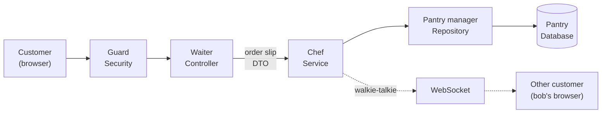
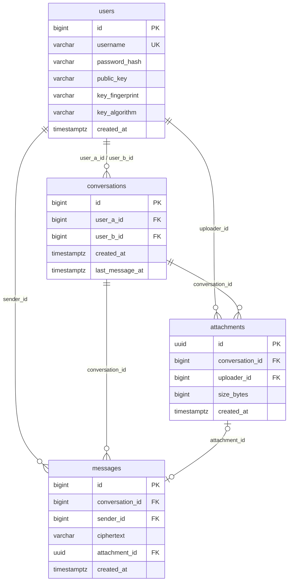
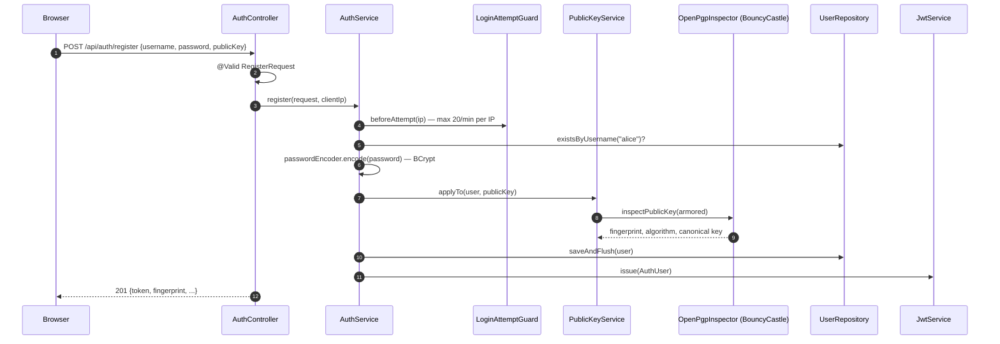
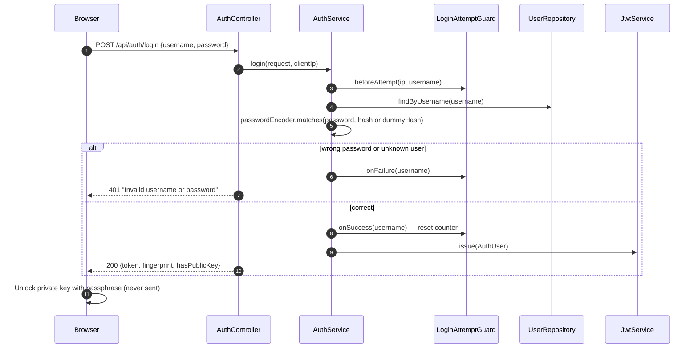
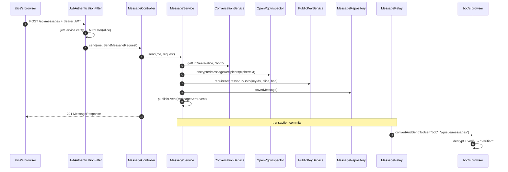
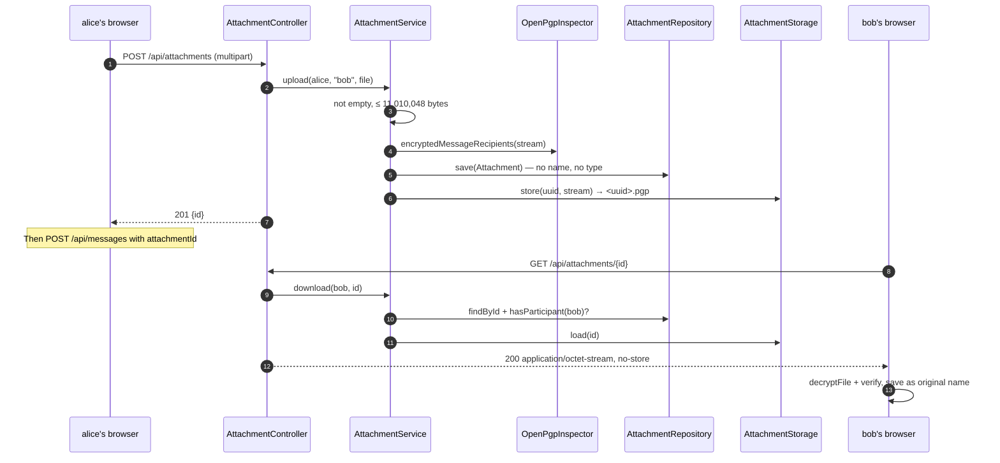
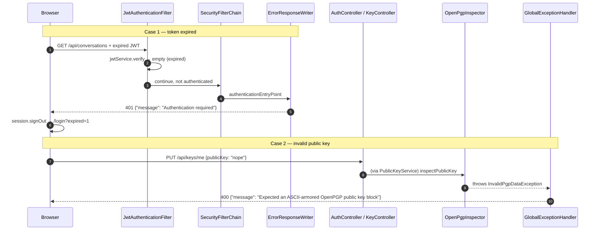
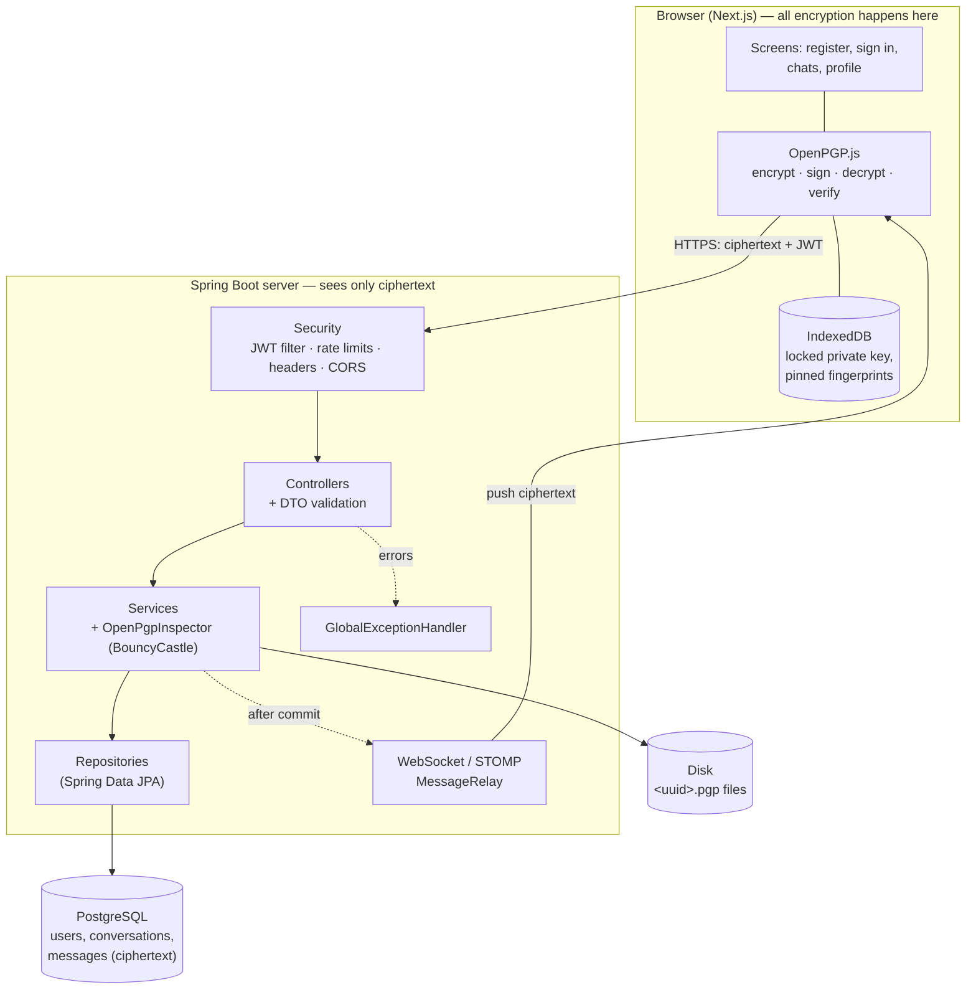

# Learn PGP from the beginning, Part IV: Spring Boot architecture, layer by layer

<SeriesNav course="/cybersecurity/pgp-from-the-beginning/" />

I assume nothing. You don't need to know Java or Spring Boot. You've seen *what* the CipherChat server does in [Part III](./part-3). Now we open it up and see *how* it's built, one layer at a time.

## Resources

- [Spring Boot reference](https://docs.spring.io/spring-boot/): the framework.
- [Spring Security reference](https://docs.spring.io/spring-security/reference/): filters, the security chain, password encoders.
- [Spring Data JPA reference](https://docs.spring.io/spring-data/jpa/reference/): repositories and query methods.
- [Spring WebSocket and STOMP](https://docs.spring.io/spring-framework/reference/web/websocket/stomp.html)
- [Flyway documentation](https://documentation.red-gate.com/flyway)
- [BouncyCastle Java](https://www.bouncycastle.org/documentation/)
- [RFC 9580, the OpenPGP standard](https://www.rfc-editor.org/rfc/rfc9580)

## In this article we will cover

- **The restaurant.** One comparison we'll use for the whole article.
- **The foundations.** What Spring Boot is, where the app starts, dependency injection, annotations, `pom.xml` and the folder tree.
- **Every layer, one card each.** Configuration, Security, Controller, DTO, Service, Repository, Entity, Database, WebSocket, File storage, Exceptions, Tests and helper packages.
- **The user journey through the layers.** Five real requests, traced class by class.
- **The big picture.** One architecture diagram, why encryption lives in the browser, a 1-minute script and 10 interview questions.

[[toc]]

## The restaurant: one comparison for everything

A request to CipherChat is like an order in a restaurant. We'll use this all the way through.

| Restaurant | CipherChat layer | Real classes |
| --- | --- | --- |
| Security guard at the door | **Security** | `SecurityConfig`, `JwtAuthenticationFilter`, `JwtService` |
| Waiter | **Controller** | `AuthController`, `MessageController`, ... |
| Order slip | **DTO** | `RegisterRequest`, `MessageResponse`, ... |
| Chef | **Service** | `AuthService`, `MessageService`, ... |
| Pantry manager | **Repository** | `UserRepository`, `MessageRepository`, ... |
| Pantry | **Database** | PostgreSQL tables from `V1__init.sql` |
| Kitchen rules | **Configuration** | `application.yml`, `AppProperties`, `WebSocketConfig` |
| Manager handling complaints | **Exception handler** | `GlobalExceptionHandler` |
| Walkie-talkie | **WebSocket** | `WebSocketConfig`, `MessageRelay` |



## The foundations

### What Spring Boot is, and why it's used

**Spring Boot** is a Java framework for building web servers. It gives you a working server, database access, security and JSON handling out of the box, so you write only the parts that are unique to your app. It's one of the most common choices for company backends, which is why CipherChat uses it.

### Where the app starts: `@SpringBootApplication`

Every Spring Boot app has one class with a `main` method. This is CipherChat's ([`CipherChatApplication.java` lines 7–14](https://github.com/angelabs-png/cipherchat/blob/0033149090aa01b53d9ccd7ccadaf8929bfe4974/backend/src/main/java/com/cipherchat/CipherChatApplication.java#L7-L14)):

```java:line-numbers=7
@SpringBootApplication
@ConfigurationPropertiesScan
public class CipherChatApplication {

    public static void main(String[] args) {
        SpringApplication.run(CipherChatApplication.class, args);
    }
}
```

Let's break it down:

- **`@SpringBootApplication`**: tells Spring to scan the `com.cipherchat` package for classes to manage, and to configure itself automatically.
- **`@ConfigurationPropertiesScan`**: finds `AppProperties`, which reads the `app:` settings from `application.yml`.
- **`SpringApplication.run(...)`**: starts everything: the web server on port 8080, the database connection, Flyway and security.

### Dependency Injection and Beans

**Spring hands each class the tools it needs, so classes don't build their own.** The objects Spring creates and manages are called **beans**.

In the restaurant, the chef doesn't build their own oven. The restaurant provides one. Here's the chef, `AuthService`, asking for its tools in its constructor ([`AuthService.java` lines 33–41](https://github.com/angelabs-png/cipherchat/blob/0033149090aa01b53d9ccd7ccadaf8929bfe4974/backend/src/main/java/com/cipherchat/service/AuthService.java#L33-L41)):

```java:line-numbers=33
    public AuthService(UserRepository users, PasswordEncoder passwordEncoder, JwtService jwtService,
                       LoginAttemptGuard attemptGuard, PublicKeyService publicKeyService) {
        this.users = users;
        this.passwordEncoder = passwordEncoder;
        this.jwtService = jwtService;
        this.attemptGuard = attemptGuard;
        this.publicKeyService = publicKeyService;
        this.dummyHash = passwordEncoder.encode("timing-equaliser-" + System.nanoTime());
    }
```

Let's break it down:

- **Constructor parameters**: the five tools `AuthService` needs. It never calls `new UserRepository()` itself.
- **Spring fills them in**: at startup, Spring sees this constructor, finds a bean of each type, and passes them in. This is **constructor injection**.
- **`PasswordEncoder`**: comes from the `@Bean` method in `SecurityConfig` (BCrypt). `AuthService` doesn't know or care which algorithm it is.
- **Why it matters**: tests can pass in different tools, and swapping BCrypt for another encoder means changing one line in one place.

> **Tip:** Every CipherChat class uses constructor injection. There's no `@Autowired` on fields in the main code. That's the recommended style: dependencies are explicit and `final`.

### Common annotations cheat sheet

Annotations are the `@Words` above classes and methods. They tell Spring what something is.

| Annotation | One-line meaning | Example in CipherChat |
| --- | --- | --- |
| `@SpringBootApplication` | The starting point; turns on auto-configuration and scanning. | `CipherChatApplication` |
| `@Configuration` | This class contains setup code. | `SecurityConfig`, `WebSocketConfig` |
| `@Bean` | The object this method returns is managed by Spring. | `passwordEncoder()` in `SecurityConfig` |
| `@ConfigurationProperties` | Copy settings from `application.yml` into this object. | `AppProperties` |
| `@RestController` | Handles HTTP requests and returns JSON. | `AuthController` |
| `@RequestMapping`, `@GetMapping`, `@PostMapping`, `@PutMapping` | Which URL and HTTP method a class or method handles. | `@PostMapping("/register")` |
| `@RequestBody`, `@PathVariable`, `@RequestParam`, `@RequestPart` | Where an input comes from: JSON body, URL path, query string, multipart form. | `KeyController.get(@PathVariable ...)` |
| `@AuthenticationPrincipal` | Give me the logged-in user. | `MessageController.send(@AuthenticationPrincipal AuthUser me, ...)` |
| `@ResponseStatus` | Which HTTP status to return on success. | `HttpStatus.CREATED` on register |
| `@Valid` / `@Validated` | Check the input's validation rules before running. | `@Valid @RequestBody RegisterRequest` |
| `@NotBlank`, `@Size`, `@Pattern` | Validation rules on a field. | `RegisterRequest.password` |
| `@Service` | A class holding business logic. | `MessageService` |
| `@Component` | A general Spring-managed class. | `OpenPgpInspector`, `MessageRelay` |
| `@Repository` | Marks a data-access class. **CipherChat doesn't need it**: interfaces that extend `JpaRepository` are found automatically. | `UserRepository` (no annotation) |
| `@Entity`, `@Table`, `@Id`, `@Column`, `@ManyToOne` | Map a Java class to a database table. | `Message` |
| `@Query` | A custom database query on a repository method. | `ConversationRepository.findAllForUser` |
| `@Transactional` | Run the whole method as one database transaction. | `MessageService.send` |
| `@TransactionalEventListener` | Run when an event fires, after the transaction commits. | `MessageRelay.onMessageSent` |
| `@EnableWebSocketMessageBroker` | Turn on WebSocket messaging with STOMP. | `WebSocketConfig` |
| `@RestControllerAdvice`, `@ExceptionHandler` | Catch exceptions from all controllers and turn them into responses. | `GlobalExceptionHandler` |

### `pom.xml`: the dependencies, and who uses them

`pom.xml` is the shopping list Maven uses to download libraries ([`pom.xml`](https://github.com/angelabs-png/cipherchat/blob/0033149090aa01b53d9ccd7ccadaf8929bfe4974/backend/pom.xml)). Spring Boot is version 3.5.16, on Java 21.

| Dependency | What it brings | Layer that uses it |
| --- | --- | --- |
| `spring-boot-starter-web` | Web server (Tomcat), REST controllers, JSON | Controller, DTO |
| `spring-boot-starter-security` | Security filter chain, BCrypt | Security, Configuration |
| `spring-boot-starter-data-jpa` | JPA, Hibernate, repositories, transactions | Repository, Entity, Service |
| `spring-boot-starter-websocket` | WebSocket and STOMP broker | WebSocket |
| `spring-boot-starter-validation` | `@NotBlank`, `@Size`, `@Valid` | DTO, Controller, Configuration |
| `spring-boot-starter-actuator` | `/actuator/health` | Configuration (health checks) |
| `postgresql` | Database driver | Database |
| `flyway-core`, `flyway-database-postgresql` | Database migrations | Database |
| `bcprov-jdk18on`, `bcpg-jdk18on` (BouncyCastle 1.86) | Reading OpenPGP keys and messages | Service (`OpenPgpInspector`) |
| `jjwt-api`, `jjwt-impl`, `jjwt-jackson` (0.12.7) | Creating and checking JWTs | Security (`JwtService`) |
| `springdoc-openapi-starter-webmvc-ui` | Swagger UI | Configuration (`OpenApiConfig`) |
| `spring-boot-starter-test`, `spring-security-test`, `h2` | JUnit, MockMvc, in-memory database | Tests |

### The backend folder tree

```text
backend/src/main/java/com/cipherchat/
├── CipherChatApplication.java   ← the starting point
├── config/        ← kitchen rules: settings, security chain, WebSocket, Swagger, clock
├── security/      ← the guard: JWT, login rate limits, WebSocket auth
├── controller/    ← waiters: one class per API area, maps URLs to services
├── dto/           ← order slips: request and response records
├── service/       ← chefs: business rules, PGP checks, file storage, WebSocket relay
├── repository/    ← pantry managers: database access interfaces
├── model/         ← what's in the pantry: @Entity classes (User, Conversation, Message, Attachment)
└── exception/     ← the complaints manager: error types and the global handler
backend/src/main/resources/
├── application.yml          ← main settings (reads environment variables)
├── application-local.yml    ← dev settings for ./mvnw spring-boot:run
└── db/migration/V1__init.sql ← the database tables
```

## The layers, one card each

<div class="layer-card">

### 1. Configuration

**What it is:** the settings and setup code that decide how every other layer behaves.
**Restaurant:** the kitchen rules pinned to the wall: opening hours, portion sizes, who may enter.

**What's in it in CipherChat:**

- [`application.yml`](https://github.com/angelabs-png/cipherchat/blob/0033149090aa01b53d9ccd7ccadaf8929bfe4974/backend/src/main/resources/application.yml): database, JWT, CORS, limits. Values come from **environment variables** like `${JWT_SECRET:}`, with defaults after the colon.
- **Profiles**: `application-local.yml` (used automatically by `./mvnw spring-boot:run`) and `application-test.yml` (tests, H2 database). A profile file overrides the main one.
- [`AppProperties`](https://github.com/angelabs-png/cipherchat/blob/0033149090aa01b53d9ccd7ccadaf8929bfe4974/backend/src/main/java/com/cipherchat/config/AppProperties.java): the `app:` settings as a typed, validated Java record.
- `@Configuration` classes: `SecurityConfig` (security chain, CORS, BCrypt), `WebSocketConfig`, `OpenApiConfig`, `ClockConfig`.

```java:line-numbers=14
@Validated
@ConfigurationProperties(prefix = "app")
public record AppProperties(
        @Valid @NotNull Jwt jwt,
        @Valid @NotNull Cors cors,
        @Valid @NotNull Attachments attachments,
        @Valid @NotNull Messages messages,
        @Valid @NotNull LoginRateLimit loginRateLimit) {

    public record Jwt(
            @NotBlank(message = "JWT_SECRET must be set") String secret,
            @NotNull Duration ttl,
            @NotBlank String issuer) {
    }
```

Let's break it down:

- **`@ConfigurationProperties(prefix = "app")`**: copies everything under `app:` in the YAML into this record.
- **`@Validated`** + **`@NotBlank(message = "JWT_SECRET must be set")`**: if the secret is missing, the app **refuses to start**. It fails fast instead of running insecurely.
- **`Duration ttl`**: `PT12H` in YAML becomes a Java `Duration` of 12 hours automatically.

**CORS** (which websites may call the API) is in [`SecurityConfig` lines 69–81](https://github.com/angelabs-png/cipherchat/blob/0033149090aa01b53d9ccd7ccadaf8929bfe4974/backend/src/main/java/com/cipherchat/config/SecurityConfig.java#L69-L81): only the frontend origin (`http://localhost:3000` by default), only the `Authorization` and `Content-Type` headers, and no cookies.

**Responsible for:** settings, wiring beans together. **Must NOT:** contain business logic, or hard-code real secrets.

**PGP/security here:** the JWT secret must be set and (checked in `JwtService`) at least 32 bytes. Size limits for ciphertext and attachments live here.

**Journey steps:** all of them. Every layer reads its settings from here.

**Interview question:** *"How do you keep secrets out of the code?"*
Answer: `application.yml` only references environment variables like `${JWT_SECRET:}`. `AppProperties` validates them, so the app won't start without a secret. The only fixed values are in the dev-only `local` profile.

</div>

<div class="layer-card">

### 2. Security

**What it is:** the code that decides who may make each request, before any controller runs.
**Restaurant:** the security guard at the door who checks your booking before letting you in.

**What's in it in CipherChat:**

- [`SecurityConfig`](https://github.com/angelabs-png/cipherchat/blob/0033149090aa01b53d9ccd7ccadaf8929bfe4974/backend/src/main/java/com/cipherchat/config/SecurityConfig.java): the **`SecurityFilterChain`**, the **BCrypt `PasswordEncoder`** (strength 12), CORS and security headers.
- [`JwtAuthenticationFilter`](https://github.com/angelabs-png/cipherchat/blob/0033149090aa01b53d9ccd7ccadaf8929bfe4974/backend/src/main/java/com/cipherchat/security/JwtAuthenticationFilter.java): reads `Authorization: Bearer <token>` on every request.
- [`JwtService`](https://github.com/angelabs-png/cipherchat/blob/0033149090aa01b53d9ccd7ccadaf8929bfe4974/backend/src/main/java/com/cipherchat/security/JwtService.java): the **JWT utility**. Issues and verifies tokens (HS256, issuer `cipherchat`, 12 hours).
- [`LoginAttemptGuard`](https://github.com/angelabs-png/cipherchat/blob/0033149090aa01b53d9ccd7ccadaf8929bfe4974/backend/src/main/java/com/cipherchat/security/LoginAttemptGuard.java) + [`FixedWindowRateLimiter`](https://github.com/angelabs-png/cipherchat/blob/0033149090aa01b53d9ccd7ccadaf8929bfe4974/backend/src/main/java/com/cipherchat/security/FixedWindowRateLimiter.java): **rate limiting**. 5 failed logins per username per minute, 20 auth requests per IP per minute.
- [`StompAuthChannelInterceptor`](https://github.com/angelabs-png/cipherchat/blob/0033149090aa01b53d9ccd7ccadaf8929bfe4974/backend/src/main/java/com/cipherchat/security/StompAuthChannelInterceptor.java): the guard for WebSocket (card 9).
- `AuthUser` (the logged-in user) and `ClientIpResolver` (the caller's IP).

> **Note:** CipherChat has **no `UserDetailsService`**. That interface is for Spring's built-in login forms. Here, `AuthService` checks the password with BCrypt itself, and the JWT filter builds the logged-in user straight from the verified token. That's a common, simpler design for token-based APIs.

**Which endpoints are public vs protected** ([lines 46–53](https://github.com/angelabs-png/cipherchat/blob/0033149090aa01b53d9ccd7ccadaf8929bfe4974/backend/src/main/java/com/cipherchat/config/SecurityConfig.java#L46-L53)):

```java:line-numbers=46
                .authorizeHttpRequests(auth -> auth
                        .requestMatchers(HttpMethod.OPTIONS, "/**").permitAll()
                        .requestMatchers(HttpMethod.POST, "/api/auth/register", "/api/auth/login").permitAll()
                        .requestMatchers("/swagger-ui.html", "/swagger-ui/**", "/v3/api-docs/**").permitAll()
                        .requestMatchers("/actuator/health", "/error").permitAll()
                        // The STOMP CONNECT frame is authenticated by StompAuthChannelInterceptor.
                        .requestMatchers("/ws", "/ws/**").permitAll()
                        .anyRequest().authenticated())
```

Let's break it down:

- **`OPTIONS`**: browser CORS "preflight" checks are allowed.
- **`/api/auth/register`, `/api/auth/login`**: public, otherwise nobody could sign up or sign in.
- **Swagger, health, `/error`**: public documentation and monitoring.
- **`/ws`**: public at the HTTP level, because the WebSocket guard checks the token inside the connection instead.
- **`anyRequest().authenticated()`**: everything else needs a valid JWT.

The filter that checks the token ([`JwtAuthenticationFilter` lines 37–44](https://github.com/angelabs-png/cipherchat/blob/0033149090aa01b53d9ccd7ccadaf8929bfe4974/backend/src/main/java/com/cipherchat/security/JwtAuthenticationFilter.java#L37-L44)):

```java:line-numbers=37
        String header = request.getHeader(HttpHeaders.AUTHORIZATION);
        if (header != null && header.startsWith(BEARER)) {
            jwtService.verify(header.substring(BEARER.length()).trim())
                    // Reject tokens for accounts that no longer exist.
                    .filter(user -> users.existsById(user.id()))
                    .ifPresent(user -> SecurityContextHolder.getContext().setAuthentication(toAuthentication(user)));
        }
        chain.doFilter(request, response);
```

Let's break it down:

- **`getHeader(AUTHORIZATION)`**: reads `Bearer eyJ...`.
- **`jwtService.verify(...)`**: checks the signature, the issuer and the expiry. Returns empty if anything's wrong.
- **`existsById`**: a valid token for a deleted account is ignored.
- **`setAuthentication(...)`**: marks the request as logged in, as that user.
- **`chain.doFilter(...)`**: always continues. If no user was set, the `authenticated()` rule later answers `401`.

**Security headers** ([lines 59–64](https://github.com/angelabs-png/cipherchat/blob/0033149090aa01b53d9ccd7ccadaf8929bfe4974/backend/src/main/java/com/cipherchat/config/SecurityConfig.java#L59-L64)): Content-Security-Policy, `Referrer-Policy: no-referrer`, a Permissions-Policy that blocks camera, microphone, location and payment, `X-Frame-Options: DENY`, and HSTS. CSRF protection is off on purpose: the API uses bearer tokens, not cookies.

**Responsible for:** authentication, rate limiting, headers, CORS. **Must NOT:** contain business rules (like "who may read this conversation"). That's the service layer.

**PGP/security here:** everything in this card. BCrypt hashes passwords. Failed-login answers are identical whether or not the user exists, and `AuthService` compares against a dummy hash for unknown users so the timing is the same too.

**Journey steps:** 1 and 4 (rate limits, BCrypt), every request after sign-in (JWT), 10 (expired login).

**Interview question:** *"Why are JWTs stored in `sessionStorage` and not cookies, and why is CSRF disabled?"*
Answer: The frontend sends the token in the `Authorization` header, so there's no cookie a malicious site could make the browser send automatically. CSRF attacks rely on cookies, so CSRF tokens add nothing. `sessionStorage` is cleared when the tab closes.

</div>

<div class="layer-card">

### 3. Controller (API)

**What it is:** the classes that receive HTTP requests, check the input, call a service and return the response.
**Restaurant:** the waiter. Takes your order, checks it's filled in properly, passes it to the kitchen, brings back the plate. The waiter doesn't cook.

**Every endpoint in CipherChat:**

| Controller | Endpoint | Success | Common errors |
| --- | --- | --- | --- |
| [`AuthController`](https://github.com/angelabs-png/cipherchat/blob/0033149090aa01b53d9ccd7ccadaf8929bfe4974/backend/src/main/java/com/cipherchat/controller/AuthController.java) | `POST /api/auth/register` (public) | `201` + token | `400` validation or bad key, `409` name taken, `429` |
| | `POST /api/auth/login` (public) | `200` + token | `401`, `429` |
| [`KeyController`](https://github.com/angelabs-png/cipherchat/blob/0033149090aa01b53d9ccd7ccadaf8929bfe4974/backend/src/main/java/com/cipherchat/controller/KeyController.java) | `PUT /api/keys/me` | `200` + key info | `400` invalid key |
| | `GET /api/keys/{username}` | `200` + key info | `404` no user or no key |
| [`UserController`](https://github.com/angelabs-png/cipherchat/blob/0033149090aa01b53d9ccd7ccadaf8929bfe4974/backend/src/main/java/com/cipherchat/controller/UserController.java) | `GET /api/users?query=` | `200` + up to 20 users | `400` bad query |
| [`ConversationController`](https://github.com/angelabs-png/cipherchat/blob/0033149090aa01b53d9ccd7ccadaf8929bfe4974/backend/src/main/java/com/cipherchat/controller/ConversationController.java) | `GET /api/conversations` | `200` | |
| | `POST /api/conversations` | `200` (get or create) | `404`, `400` (yourself) |
| | `GET /api/conversations/{id}/messages?before=&size=` | `200`, oldest first | `404` not a participant |
| [`MessageController`](https://github.com/angelabs-png/cipherchat/blob/0033149090aa01b53d9ccd7ccadaf8929bfe4974/backend/src/main/java/com/cipherchat/controller/MessageController.java) | `POST /api/messages` | `201` | `400` not valid ciphertext, `413` |
| [`AttachmentController`](https://github.com/angelabs-png/cipherchat/blob/0033149090aa01b53d9ccd7ccadaf8929bfe4974/backend/src/main/java/com/cipherchat/controller/AttachmentController.java) | `POST /api/attachments` (multipart) | `201` + id | `400`, `413` |
| | `GET /api/attachments/{id}` | `200` bytes | `404` |

Every protected endpoint returns `401` without a valid token.

A typical controller ([`AuthController` lines 30–41](https://github.com/angelabs-png/cipherchat/blob/0033149090aa01b53d9ccd7ccadaf8929bfe4974/backend/src/main/java/com/cipherchat/controller/AuthController.java#L30-L41)):

```java:line-numbers=30
    @Operation(summary = "Create an account (optionally with a public key) and receive a JWT")
    @PostMapping("/register")
    @ResponseStatus(HttpStatus.CREATED)
    public AuthResponse register(@Valid @RequestBody RegisterRequest request, HttpServletRequest http) {
        return authService.register(request, ClientIpResolver.resolve(http));
    }

    @Operation(summary = "Exchange username and password for a JWT. Rate limited.")
    @PostMapping("/login")
    public AuthResponse login(@Valid @RequestBody LoginRequest request, HttpServletRequest http) {
        return authService.login(request, ClientIpResolver.resolve(http));
    }
```

Let's break it down:

- **`@Operation`**: the description shown in Swagger UI.
- **`@PostMapping("/register")`**: handles `POST /api/auth/register` (the class adds `/api/auth`).
- **`@ResponseStatus(HttpStatus.CREATED)`**: success returns `201 Created`.
- **`@Valid @RequestBody RegisterRequest`**: turns the JSON body into a `RegisterRequest` and checks its rules first. Invalid input never reaches the service.
- **One line of work**: the controller just hands over to `authService`. That's how thin a controller should be.

**Responsible for:** URLs, HTTP methods, input validation, status codes. **Must NOT:** contain business logic, or touch repositories directly.

**PGP/security here:** `@AuthenticationPrincipal AuthUser me` gives each method the verified user from the JWT, so a user can never act as someone else by changing an ID in the request.

**Journey steps:** all of them. Creating an account goes through `AuthController → AuthService → UserRepository`.

**Interview question:** *"What does `@Valid` do, and what happens when validation fails?"*
Answer: It runs the rules on the DTO (like `@NotBlank`, `@Size`) before the method runs. If one fails, Spring throws `MethodArgumentNotValidException`, and `GlobalExceptionHandler` returns `400` with a `fieldErrors` map, like `{"password": "must be 10-72 characters"}`.

</div>

<div class="layer-card">

### 4. DTO (Data Transfer Objects)

**What it is:** small classes that describe exactly what comes in and goes out of the API.
**Restaurant:** the order slip. It lists what the customer wants, not the whole pantry.

**What's in it in CipherChat:** 13 Java **records** in [`dto/`](https://github.com/angelabs-png/cipherchat/tree/0033149090aa01b53d9ccd7ccadaf8929bfe4974/backend/src/main/java/com/cipherchat/dto).

- **Requests:** `RegisterRequest`, `LoginRequest`, `UploadKeyRequest`, `SendMessageRequest`, `StartConversationRequest`.
- **Responses:** `AuthResponse`, `KeyResponse`, `UserSummary`, `ConversationResponse`, `MessageResponse`, `AttachmentResponse`, `ApiError`.
- **Internal:** `PublicKeyInfo` (facts extracted from a key by BouncyCastle; never sent as-is).

A request with its validation rules ([`RegisterRequest.java` lines 9–18](https://github.com/angelabs-png/cipherchat/blob/0033149090aa01b53d9ccd7ccadaf8929bfe4974/backend/src/main/java/com/cipherchat/dto/RegisterRequest.java#L9-L18)):

```java:line-numbers=9
@Schema(description = "New account. publicKey is optional here and can be uploaded later via PUT /api/keys/me.")
public record RegisterRequest(
        @NotBlank @Pattern(regexp = User.USERNAME_REGEX, message = "3-32 characters: letters, digits or underscore")
        String username,
        @NotBlank @Size(min = 10, max = 72, message = "must be 10-72 characters")
        String password,
        @Size(max = 20000, message = "is too large")
        @Schema(description = "ASCII-armored OpenPGP public key", nullable = true)
        String publicKey) {
}
```

Let's break it down:

- **`record`**: a compact, read-only Java class. Perfect for data that just travels.
- **`@Pattern(regexp = User.USERNAME_REGEX)`**: 3–32 letters, digits or underscores.
- **`@Size(min = 10, max = 72)`** on password: 72 is BCrypt's maximum input length.
- **`publicKey` max 20,000 characters**: stops someone uploading a huge "key".

**Why entities are never sent to the client:** the `User` entity has a `passwordHash` field. Returning it directly would leak it. Instead, each response DTO copies only safe fields, using a small `from()` method ([`UserSummary.java` lines 6–11](https://github.com/angelabs-png/cipherchat/blob/0033149090aa01b53d9ccd7ccadaf8929bfe4974/backend/src/main/java/com/cipherchat/dto/UserSummary.java#L6-L11)):

```java:line-numbers=6
public record UserSummary(String username, boolean hasPublicKey, String fingerprint) {

    public static UserSummary from(User user) {
        return new UserSummary(user.getUsername(), user.hasPublicKey(), user.getKeyFingerprint());
    }
}
```

Let's break it down:

- **Three fields only**: username, whether they have a key, and their fingerprint. No id, no password hash.
- **`from(User user)`**: the mapping from entity to DTO. CipherChat does this in each DTO instead of a separate mapper library.

**Responsible for:** the API's shape and input rules. **Must NOT:** contain logic, or expose entity internals.

**PGP/security here:** `SendMessageRequest.ciphertext` is documented as "Plaintext is rejected". `UploadKeyRequest` says "never the private key".

**Journey steps:** all. Step 1 uses `RegisterRequest` → `AuthResponse`. Step 6 uses `SendMessageRequest` → `MessageResponse`.

**Interview question:** *"Why use DTOs instead of returning your entities?"*
Answer: Security and stability. Entities hold internal fields like `passwordHash` and lazy database links. DTOs expose only what the client needs, and let the database change without breaking the API.

</div>

<div class="layer-card">

### 5. Service (business logic)

**What it is:** the classes that make the real decisions and enforce the rules.
**Restaurant:** the chef. Follows the recipe, checks the ingredients, decides if a dish can be served.

**Every service class in CipherChat** ([`service/`](https://github.com/angelabs-png/cipherchat/tree/0033149090aa01b53d9ccd7ccadaf8929bfe4974/backend/src/main/java/com/cipherchat/service)):

| Class | Job |
| --- | --- |
| `AuthService` | Register (hash password, apply key) and log in (BCrypt check, rate limits, issue JWT). Lowercases usernames. |
| `UserService` | Username prefix search, max 20 results, excluding yourself. |
| `PublicKeyService` | Store a validated key; fetch a key; check a message is addressed to both people. |
| `ConversationService` | Get or create the one conversation between two users; check you're a participant. |
| `MessageService` | Validate, store and announce messages; page through history. |
| `AttachmentService` | Validate, store and serve encrypted files. |
| `OpenPgpInspector` | All BouncyCastle checks. |
| `AttachmentStorage` | Read and write encrypted files on disk (card 10). |
| `MessageRelay` | Push stored messages over WebSocket after commit (card 9). |

**`@Transactional`**: methods that write, like `MessageService.send`, run as one transaction: all saved, or nothing. Read-only methods use `@Transactional(readOnly = true)`.

**BouncyCastle public key validation and fingerprint** ([`OpenPgpInspector.inspectPublicKey`, lines 64–125](https://github.com/angelabs-png/cipherchat/blob/0033149090aa01b53d9ccd7ccadaf8929bfe4974/backend/src/main/java/com/cipherchat/service/OpenPgpInspector.java#L64-L125)). Here's the heart of it:

```java:line-numbers=76
        PGPPublicKeyRing ring = readSingleRing(armored);
        PGPPublicKey primary = ring.getPublicKey();
        Instant now = clock.instant();

        if (!primary.isMasterKey()) {
            throw new InvalidPgpDataException("Key block does not start with a primary key");
        }
        if (primary.hasRevocation()) {
            throw new InvalidPgpDataException("Key has been revoked");
        }
        rejectWeak(primary);
        Instant expiresAt = expiry(primary);
        if (expiresAt != null && !expiresAt.isAfter(now)) {
            throw new InvalidPgpDataException("Key has expired");
        }
```

Let's break it down:

- **`readSingleRing(armored)`**: BouncyCastle parses the armored text. It must be exactly one key.
- **`isMasterKey()`**: the block must start with a primary key.
- **`hasRevocation()`**: a key its owner has cancelled is refused.
- **`rejectWeak(primary)`**: RSA under 2048 bits, DSA and ElGamal are refused.
- **`expiry(...)`**: an expired key is refused.

After this, the method also checks that the user ID has a **valid self-signature**, that there's at least one **valid encryption subkey**, then re-encodes the key cleanly and computes the **fingerprint** with `Hex.toHexString(primary.getFingerprint()).toUpperCase()`.

**Responsible for:** business rules, transactions, calling repositories. **Must NOT:** know about HTTP (no request or response objects), or ever decrypt anything.

**PGP/security here:** the most important checks. Key validation, "is this really ciphertext", "is it addressed to both people", "is the caller in this conversation". Outsiders get `404`, so IDs can't be probed.

**Journey steps:** all. Step 3 is `AuthService.register → PublicKeyService.applyTo → OpenPgpInspector.inspectPublicKey`.

**Interview question:** *"What does BouncyCastle do if the browser does all the encryption?"*
Answer: It's the server's inspector, not its locksmith. It validates uploaded public keys (not private, not expired, not revoked, not weak, properly self-signed, has an encryption subkey), computes fingerprints, and reads which keys a message is addressed to. It never decrypts, because the server has no private keys.

</div>

<div class="layer-card">

### 6. Repository

**What it is:** interfaces that read and write the database.
**Restaurant:** the pantry manager. The chef asks for "the user called bob", and the pantry manager fetches it.

**What's in it in CipherChat:** four interfaces in [`repository/`](https://github.com/angelabs-png/cipherchat/tree/0033149090aa01b53d9ccd7ccadaf8929bfe4974/backend/src/main/java/com/cipherchat/repository), each extending `JpaRepository`, which gives `save`, `findById`, `existsById` and more for free.

([`UserRepository.java` lines 12–24](https://github.com/angelabs-png/cipherchat/blob/0033149090aa01b53d9ccd7ccadaf8929bfe4974/backend/src/main/java/com/cipherchat/repository/UserRepository.java#L12-L24)):

```java:line-numbers=12
public interface UserRepository extends JpaRepository<User, Long> {

    Optional<User> findByUsername(String username);

    boolean existsByUsername(String username);

    @Query("""
            select u from User u
            where u.username like concat(:prefix, '%') and u.username <> :exclude
            order by u.username
            """)
    List<User> searchByPrefix(@Param("prefix") String prefix, @Param("exclude") String exclude, Pageable pageable);
}
```

Let's break it down:

- **`interface`**: there's no class that implements this. Spring Data writes the implementation at startup.
- **`JpaRepository<User, Long>`**: works with `User` entities whose ID is a `Long`.
- **`findByUsername`**: a **derived query**. Spring reads the method name (`find` + `By` + `Username`) and generates `select ... where username = ?`. No SQL written.
- **`@Query`**: when the name alone isn't enough, you write the query yourself in JPQL (SQL for Java classes). Here: usernames starting with a prefix, excluding yourself, sorted.
- **`Pageable`**: limits the results (the service asks for 20).

**Custom queries elsewhere:** `ConversationRepository.findAllForUser` (your conversations, most recent first, loading both users in one query with `join fetch`), `findPair`, and `MessageRepository.findPage` (history, newest first, paging with `beforeId`). `MessageRepository.existsByAttachmentId` is another derived query.

**Responsible for:** database access only. **Must NOT:** contain business rules.

**PGP/security here:** all queries use parameters (`:prefix`), never string concatenation, so there's no SQL injection. `UserService` also escapes `_` in searches.

**Journey steps:** all. Step 1 calls `existsByUsername` and `saveAndFlush`. Step 4 calls `findByUsername`.

**Interview question:** *"How does `findByUsername` work without any SQL?"*
Answer: Spring Data parses the method name at startup and generates the query from it: find `User` where `username` equals the parameter. It returns an `Optional` because the user might not exist.

</div>

<div class="layer-card">

### 7. Entity (model)

**What it is:** Java classes that map one-to-one to database tables.
**Restaurant:** the labelled jars in the pantry. Each jar type has a fixed shape.

**Every `@Entity` in CipherChat** ([`model/`](https://github.com/angelabs-png/cipherchat/tree/0033149090aa01b53d9ccd7ccadaf8929bfe4974/backend/src/main/java/com/cipherchat/model)):

| Entity | Fields | Relationships |
| --- | --- | --- |
| `User` | `id`, `username`, `passwordHash`, `publicKey`, `keyFingerprint`, `keyAlgorithm`, `keyCreatedAt`, `keyUploadedAt`, `createdAt` | none |
| `Conversation` | `id`, `userA`, `userB`, `createdAt`, `lastMessageAt` | two `@ManyToOne` to `User` |
| `Message` | `id`, `conversation`, `sender`, **`ciphertext`**, `attachment`, `createdAt` | `@ManyToOne` to `Conversation`, `User`, `Attachment` |
| `Attachment` | `id` (UUID), `conversation`, `uploader`, `sizeBytes`, `createdAt` | `@ManyToOne` to `Conversation`, `User` |

**Which fields hold ciphertext only:** `Message.ciphertext`. Attachment bytes aren't in the database at all; they're on disk, encrypted. `User.publicKey` is public by design.

A small but important rule, inside the entity itself ([`Conversation.java` lines 47–52](https://github.com/angelabs-png/cipherchat/blob/0033149090aa01b53d9ccd7ccadaf8929bfe4974/backend/src/main/java/com/cipherchat/model/Conversation.java#L47-L52)):

```java:line-numbers=47
    public static Conversation between(User first, User second) {
        if (first.getId().equals(second.getId())) {
            throw new IllegalArgumentException("A conversation needs two different users");
        }
        return first.getId() < second.getId() ? new Conversation(first, second) : new Conversation(second, first);
    }
```

Let's break it down:

- **`between(first, second)`**: the only way to create a conversation.
- **Same user twice**: refused.
- **Lower ID always goes in `userA`**: so alice→bob and bob→alice give the same pair. The database has a unique constraint on `(user_a_id, user_b_id)`, so there's only ever one conversation per pair.

**Responsible for:** the data's shape and simple rules about itself. **Must NOT:** be sent to clients directly (use DTOs).

**PGP/security here:** `Message.ciphertext` is commented "ASCII-armored OpenPGP message, signed and encrypted by the sender's browser". `User.publicKey` is commented "Never a private key".

**Journey steps:** all steps that store data.

**Interview question:** *"Why are the relationships `FetchType.LAZY`?"*
Answer: So loading a message doesn't automatically load its whole conversation and both users. Related data is only fetched when needed, or explicitly with `join fetch` in a query.

</div>

<div class="layer-card">

### 8. Database and migrations

**What it is:** PostgreSQL stores everything; **Flyway** creates and updates the tables from versioned SQL files.
**Restaurant:** the pantry, and the pantry's floor plan, which only changes by approved written plans.

**What's in it in CipherChat:** one migration, [`V1__init.sql`](https://github.com/angelabs-png/cipherchat/blob/0033149090aa01b53d9ccd7ccadaf8929bfe4974/backend/src/main/resources/db/migration/V1__init.sql). Flyway runs it on first start and records it, so it never runs twice. `application.yml` sets `ddl-auto: validate`: Hibernate checks the entities match the tables, but never changes the database itself.



([`V1__init.sql` lines 19–27](https://github.com/angelabs-png/cipherchat/blob/0033149090aa01b53d9ccd7ccadaf8929bfe4974/backend/src/main/resources/db/migration/V1__init.sql#L19-L27)):

```sql:line-numbers=19
CREATE TABLE conversations (
    id               BIGINT GENERATED BY DEFAULT AS IDENTITY PRIMARY KEY,
    user_a_id        BIGINT NOT NULL REFERENCES users (id),
    user_b_id        BIGINT NOT NULL REFERENCES users (id),
    created_at       TIMESTAMP WITH TIME ZONE NOT NULL,
    last_message_at  TIMESTAMP WITH TIME ZONE,
    CONSTRAINT uq_conversations_pair UNIQUE (user_a_id, user_b_id),
    CONSTRAINT ck_conversations_order CHECK (user_a_id < user_b_id)
);
```

Let's break it down:

- **`REFERENCES users (id)`**: foreign keys. A conversation can't point to a user that doesn't exist.
- **`UNIQUE (user_a_id, user_b_id)`**: one conversation per pair.
- **`CHECK (user_a_id < user_b_id)`**: the database itself enforces the ordering rule from `Conversation.between`.

**Responsible for:** storing data safely and consistently. **Must NOT:** be changed by hand. Changes go in a new file, like `V2__...sql`.

**PGP/security here:** no plaintext column exists anywhere. The file's first comment says so.

**Journey steps:** all. It's the end of every write.

**Interview question:** *"Why use Flyway instead of letting Hibernate create tables?"*
Answer: Flyway migrations are versioned SQL files in Git, so every database, from a laptop to production, is built the same way, and changes are reviewed like code. Letting Hibernate change the schema automatically is risky in production.

</div>

<div class="layer-card">

### 9. WebSocket

**What it is:** a connection that stays open, so the server can push new messages to the browser instantly.
**Restaurant:** the walkie-talkie. The kitchen can call a waiter the moment a dish is ready.

**What's in it in CipherChat:**

- [`WebSocketConfig`](https://github.com/angelabs-png/cipherchat/blob/0033149090aa01b53d9ccd7ccadaf8929bfe4974/backend/src/main/java/com/cipherchat/config/WebSocketConfig.java): the STOMP endpoint `/ws`, a simple in-memory **broker** for `/queue`, the user prefix `/user`, 10-second heartbeats, and a 256 KB frame limit.
- [`StompAuthChannelInterceptor`](https://github.com/angelabs-png/cipherchat/blob/0033149090aa01b53d9ccd7ccadaf8929bfe4974/backend/src/main/java/com/cipherchat/security/StompAuthChannelInterceptor.java): the JWT check.
- [`MessageRelay`](https://github.com/angelabs-png/cipherchat/blob/0033149090aa01b53d9ccd7ccadaf8929bfe4974/backend/src/main/java/com/cipherchat/service/MessageRelay.java): sends to `/user/{username}/queue/messages` after a message is saved.

**Destinations:** the browser subscribes to `/user/queue/messages`. Spring turns that into a private queue per user, because `AuthUser.getName()` returns the username.

**Where the JWT is checked:** not on the HTTP handshake. Browsers can't add headers to a WebSocket upgrade, and tokens in the URL end up in logs. So the token goes in the STOMP **CONNECT** frame ([lines 46–65](https://github.com/angelabs-png/cipherchat/blob/0033149090aa01b53d9ccd7ccadaf8929bfe4974/backend/src/main/java/com/cipherchat/security/StompAuthChannelInterceptor.java#L46-L65)):

```java:line-numbers=46
        switch (command) {
            case CONNECT, STOMP -> {
                String header = accessor.getFirstNativeHeader("Authorization");
                AuthUser user = header != null && header.startsWith(BEARER)
                        ? jwtService.verify(header.substring(BEARER.length()).trim())
                        .filter(u -> users.existsById(u.id()))
                        .orElse(null)
                        : null;
                if (user == null) {
                    throw new MessageDeliveryException("Authentication required");
                }
                accessor.setUser(JwtAuthenticationFilter.toAuthentication(user));
            }
            case SUBSCRIBE -> {
                requireSession(accessor);
                if (!ALLOWED_SUBSCRIPTIONS.contains(accessor.getDestination())) {
                    throw new MessageDeliveryException("Subscription not allowed");
                }
            }
            case SEND -> throw new MessageDeliveryException("Send messages via POST /api/messages");
```

Let's break it down:

- **`CONNECT`**: reads `Authorization: Bearer ...` from the STOMP frame and verifies it with the same `JwtService`. No valid token, no connection.
- **`accessor.setUser(...)`**: remembers who this connection belongs to.
- **`SUBSCRIBE`**: only `/user/queue/messages` and `/user/queue/errors` are allowed. You can't listen to anyone else's queue.
- **`SEND`**: refused. Messages must go through `POST /api/messages`, so they're always validated and saved first.

**How a new message reaches the receiver:** `MessageService.send` saves it and publishes an event. After the commit, `MessageRelay` calls `convertAndSendToUser("bob", "/queue/messages", message)`. bob's browser, subscribed through `useIncomingMessages`, gets it and decrypts it.

**Responsible for:** real-time delivery. **Must NOT:** accept messages directly, or skip validation.

**PGP/security here:** only ciphertext is pushed. Auth on CONNECT; subscriptions locked to your own queue.

**Journey steps:** 7.

**Interview question:** *"Why are messages sent over REST but received over WebSocket?"*
Answer: REST gives one clear path where every message is validated (is it ciphertext, is it addressed to both) and saved in a transaction. WebSocket is only used to push the saved result instantly. The interceptor refuses `SEND` frames to enforce that.

</div>

<div class="layer-card">

### 10. File and attachment storage

**What it is:** where encrypted file bytes are kept.
**Restaurant:** the walk-in freezer: sealed boxes, labelled with a number only.

**What's in it in CipherChat:** [`AttachmentStorage`](https://github.com/angelabs-png/cipherchat/blob/0033149090aa01b53d9ccd7ccadaf8929bfe4974/backend/src/main/java/com/cipherchat/service/AttachmentStorage.java) writes to a folder on disk: `app.attachments.dir`, which is `./data/attachments` locally and `/data/attachments` (a Docker volume) in Docker. The database only has the metadata row.

**Size limits, in three layers:**

1. **Browser:** 10 MB of plaintext (`MAX_ATTACHMENT_BYTES`).
2. **Service:** 11,010,048 bytes of ciphertext (10.5 MB, allowing for PGP overhead), else `413`.
3. **Servlet container:** 12 MB hard ceiling for any upload, else `413`.

([`AttachmentStorage.java` lines 35–44 and 59–61](https://github.com/angelabs-png/cipherchat/blob/0033149090aa01b53d9ccd7ccadaf8929bfe4974/backend/src/main/java/com/cipherchat/service/AttachmentStorage.java#L35-L44)):

```java:line-numbers=35
    public void store(UUID id, InputStream content) throws IOException {
        Path target = pathFor(id);
        Path temp = Files.createTempFile(root, "upload-", ".part");
        try {
            Files.copy(content, temp, StandardCopyOption.REPLACE_EXISTING);
            Files.move(temp, target, StandardCopyOption.ATOMIC_MOVE);
        } finally {
            Files.deleteIfExists(temp);
        }
    }
```

Let's break it down:

- **`pathFor(id)`**: the file name is `<uuid>.pgp`. The UUID is made by the server, so the client can never choose a path (no `../../etc/passwd` tricks).
- **`createTempFile` then `ATOMIC_MOVE`**: writes to a temporary file first, then moves it in one step. A half-uploaded file never appears under the real name.
- **`finally ... deleteIfExists(temp)`**: cleans up if anything fails.

**Why the server can't read them:** the bytes are OpenPGP-encrypted in the browser to bob's and alice's keys. The server has neither private key.

**Responsible for:** storing and loading bytes by ID. **Must NOT:** trust client file names or paths.

**PGP/security here:** checked as real PGP ciphertext before storing (card 5). Downloads are for participants only, with `Cache-Control: no-store`.

**Journey steps:** 8.

**Interview question:** *"Why store files on disk and not in the database?"*
Answer: Large binary blobs make databases slow and backups huge. The database keeps small metadata; the disk keeps the bytes. In production, the comment in the code says this would move to object storage like S3.

</div>

<div class="layer-card">

### 11. Exception handling

**What it is:** one place that turns every error into a clean, safe JSON response.
**Restaurant:** the manager who handles complaints politely, without letting customers into the kitchen.

**What's in it in CipherChat:**

- [`GlobalExceptionHandler`](https://github.com/angelabs-png/cipherchat/blob/0033149090aa01b53d9ccd7ccadaf8929bfe4974/backend/src/main/java/com/cipherchat/exception/GlobalExceptionHandler.java) (`@RestControllerAdvice`): catches exceptions from all controllers.
- `ApiException` (with helpers like `badRequest`, `notFound`, `conflict`), `InvalidPgpDataException` (a `400`), `RateLimitExceededException` (a `429` with `Retry-After`).
- [`ErrorResponseWriter`](https://github.com/angelabs-png/cipherchat/blob/0033149090aa01b53d9ccd7ccadaf8929bfe4974/backend/src/main/java/com/cipherchat/exception/ErrorResponseWriter.java): writes the same JSON for security errors (`401`, `403`), which happen in filters, before any controller.
- `ApiError`: the one error shape for everything.

**The error JSON:**

```json
{
  "timestamp": "2026-09-29T10:15:30Z",
  "status": 400,
  "error": "Bad Request",
  "message": "Validation failed",
  "path": "/api/auth/register",
  "fieldErrors": { "password": "must be 10-72 characters" }
}
```

The catch-all ([`GlobalExceptionHandler.java` lines 128–132](https://github.com/angelabs-png/cipherchat/blob/0033149090aa01b53d9ccd7ccadaf8929bfe4974/backend/src/main/java/com/cipherchat/exception/GlobalExceptionHandler.java#L128-L132)):

```java:line-numbers=128
    @ExceptionHandler(Exception.class)
    ResponseEntity<ApiError> handleUnexpected(Exception ex, HttpServletRequest request) {
        log.error("Unhandled error on {} {}", request.getMethod(), request.getRequestURI(), ex);
        return build(HttpStatus.INTERNAL_SERVER_ERROR, "An unexpected error occurred", request);
    }
```

Let's break it down:

- **`@ExceptionHandler(Exception.class)`**: catches anything not handled more specifically.
- **`log.error(..., ex)`**: the full details and stack trace go to the **server log** only.
- **`"An unexpected error occurred"`**: the client gets a generic message and a `500`.

**Why stack traces are never shown:** they reveal class names, library versions and file paths that help attackers. `application.yml` also sets `include-stacktrace: never`.

**Responsible for:** mapping errors to status codes and safe messages. **Must NOT:** leak internals.

**PGP/security here:** PGP problems come back as clear `400` messages, like "That is a PRIVATE key. Never upload it; upload your public key only".

**Journey steps:** 10 (everything that goes wrong).

**Interview question:** *"What's the difference between an error in a controller and a `401` from security?"*
Answer: Controller errors are caught by `@RestControllerAdvice`. A `401` happens in the security filter chain, before any controller, so advice never sees it. That's why `SecurityConfig` uses `ErrorResponseWriter` in its entry point, to produce the same JSON shape.

</div>

<div class="layer-card">

### 12. Tests

**What it is:** code that checks the app works, run with `./mvnw test`.
**Restaurant:** the health inspector, visiting before every opening.

**What's in it in CipherChat:** 47 tests, all passing at this commit, in [`backend/src/test`](https://github.com/angelabs-png/cipherchat/tree/0033149090aa01b53d9ccd7ccadaf8929bfe4974/backend/src/test/java/com/cipherchat).

| Test class | Type | Layers covered |
| --- | --- | --- |
| `OpenPgpInspectorTest` | Unit | Service: key validation, fingerprint, reading recipients |
| `FixedWindowRateLimiterTest` | Unit | Security: rate limiter windows |
| `AuthControllerTest` | Integration (MockMvc) | Controller → Security → Service → Repository → H2; headers, CORS, rate limits |
| `KeyAndUserControllerTest` | Integration | Key upload/fetch, user search |
| `MessageControllerTest` | Integration | Sending, rejecting plaintext, history, participants only |
| `AttachmentControllerTest` | Integration | Upload, download, size limits, outsiders get 404 |
| `WebSocketIntegrationTest` | Integration (real server, random port) | STOMP connect with/without token, real-time delivery |

- **Unit tests** test one class alone, with no Spring and no database.
- **Integration tests** start the whole app with `@SpringBootTest` and call it through **MockMvc**, a fake HTTP client that doesn't need a real network.
- **H2** is an in-memory database in PostgreSQL mode. Flyway runs the same `V1__init.sql` on it.
- The PGP test data in `src/test/resources/pgp/` was generated by **OpenPGP.js** (`generate-fixtures.mjs`), so the server is tested against exactly what browsers produce.

([`AuthControllerTest.java` lines 122–136](https://github.com/angelabs-png/cipherchat/blob/0033149090aa01b53d9ccd7ccadaf8929bfe4974/backend/src/test/java/com/cipherchat/controller/AuthControllerTest.java#L122-L136)):

```java:line-numbers=122
    @Test
    void loginFailureDoesNotRevealWhetherUserExists() throws Exception {
        String name = uniqueName("enum");
        api.register(name);

        mvc.perform(post("/api/auth/login")
                        .contentType(MediaType.APPLICATION_JSON)
                        .content(api.toJson(map("username", name, "password", "wrong password!"))))
                .andExpect(status().isUnauthorized())
                .andExpect(jsonPath("$.message").value("Invalid username or password"));
```

Let's break it down:

- **`@Test`**: JUnit runs this method as a test.
- **`api.register(name)`**: creates a real user in the H2 database.
- **`mvc.perform(post(...))`**: sends a fake HTTP request through the full app.
- **`status().isUnauthorized()`** and the message: a wrong password gets `401` "Invalid username or password". The next lines check that an unknown user gets the **exact same** answer, so attackers can't discover usernames.

**Responsible for:** catching regressions. **Must NOT:** depend on the real PostgreSQL database or on each other.

**PGP/security here:** most tests are security tests: plaintext rejected, private keys rejected, outsiders get 404, headers present, rate limits work.

**Journey steps:** every step has at least one test.

**Interview question:** *"What's the difference between your unit and integration tests?"*
Answer: `OpenPgpInspectorTest` creates the class directly and tests it alone, which is fast. The controller tests start the whole Spring app on an H2 database and send requests through MockMvc, so they test all layers together, including security.

</div>

<div class="layer-card">

### 13. Other packages and helpers

**What they are:** small pieces that don't fit one layer.
**Restaurant:** the staff noticeboard and the clock on the wall.

- **`security/AuthUser`**: a tiny record (`id`, `username`) for the logged-in user. It implements `Principal`, which is what makes `/user/queue/messages` resolve by username.
- **`security/ClientIpResolver`**: gets the caller's IP from the socket, never from the `X-Forwarded-For` header, which clients could fake to dodge rate limits.
- **`config/ClockConfig`**: provides a `Clock` bean. Classes like `OpenPgpInspector` ask for it instead of calling "now" directly, so tests can control time.
- **Test helpers** in `support/`: `ApiClient` (register and log in quickly), `Fixtures` (load PGP test files), and `@IntegrationTest` (one annotation that bundles `@SpringBootTest`, `@AutoConfigureMockMvc` and the `test` profile).

> **Note:** There's no `utils` or `mapper` package. Mapping from entities to DTOs happens in each DTO's static `from()` method.

**Interview question:** *"Why inject a `Clock` instead of calling `Instant.now()`?"*
Answer: So time is a dependency like any other. Tests can pass a fixed clock and check expiry logic, for example that the rate limiter recovers after its window.

</div>

## The user journey through every layer

### Creating an account and uploading the public key



1. `AuthController.register` validates the JSON as a `RegisterRequest`.
2. `AuthService.register` lowercases the username and calls `LoginAttemptGuard.beforeAttempt` (per-IP limit).
3. `UserRepository.existsByUsername` checks the name is free, else `409`.
4. BCrypt hashes the password.
5. `PublicKeyService.applyTo` calls `OpenPgpInspector.inspectPublicKey`: BouncyCastle validates the key and computes its fingerprint. `User.setPublicKey` stores the canonical key and fingerprint.
6. `saveAndFlush` writes the user; `JwtService.issue` creates the token.
7. The browser compares the returned fingerprint with its own before continuing.

### Logging in



1. `AuthService.login` checks both rate limits first (`429` if exceeded).
2. `findByUsername` loads the user. If there's no such user, BCrypt still runs against `dummyHash`, so the response time gives nothing away.
3. `passwordEncoder.matches` compares the password with the BCrypt hash.
4. Failure: the per-username counter goes up, and the answer is `401` with a generic message. Success: the counter resets, and `JwtService.issue` signs a 12-hour token.
5. The browser then unlocks the private key locally with the passphrase.

### Sending a message over REST and delivering it over WebSocket



1. `JwtAuthenticationFilter` turns the token into `AuthUser(alice)`.
2. `MessageController.send` validates the `SendMessageRequest` and passes it on.
3. `MessageService.send` checks the size, gets the conversation, reads the recipient key IDs with BouncyCastle, and checks they include bob's and alice's keys.
4. `MessageRepository.save` stores the ciphertext; the conversation's `lastMessageAt` is updated.
5. After commit, `MessageRelay.onMessageSent` pushes it to bob (and alice's other tabs).

### Uploading and downloading an encrypted attachment



1. `AttachmentController.upload` receives the multipart form (`recipientUsername`, `file`).
2. `AttachmentService.upload` checks size, checks it's PGP ciphertext for both people, saves the metadata row, then `AttachmentStorage.store` writes `<uuid>.pgp`.
3. The browser sends the message with the `attachmentId`. `MessageService` checks the attachment belongs to this conversation and uploader, and isn't already linked.
4. On download, `AttachmentService.download` returns `404` to anyone who isn't a participant.

### A failing request: expired JWT, or an invalid public key



**Case 1, expired login (journey step 10):**

1. `JwtService.verify` catches the `JwtException` for an expired token and returns empty.
2. The filter continues without a user. `anyRequest().authenticated()` fails.
3. The **entry point** in `SecurityConfig` calls `ErrorResponseWriter`, which writes `401` "Authentication required". `GlobalExceptionHandler` isn't involved, because this happens before any controller.
4. In the browser, `createApi` sees the `401` and calls `onUnauthorized`: the session is cleared and you land on **Sign in** with *"Your session expired. Please sign in again."*

   


**Case 2, invalid public key:**

1. `OpenPgpInspector.inspectPublicKey` throws `InvalidPgpDataException` (a `400` `ApiException`).
2. It travels up through `PublicKeyService` and the controller. The `@Transactional` method rolls back, so nothing is saved. During registration, this means no user is created (tested by `registerRejectsInvalidPublicKeyWithoutCreatingUser`).
3. `GlobalExceptionHandler.handleApi` turns it into `ApiError` JSON with status `400` and the safe message.

## The big picture



### Why encryption lives in the frontend, not in Spring Boot

If Spring Boot encrypted messages, the server would have to see the plaintext first, and hold the keys. Then anyone who hacks the server, or runs it, could read everything. By encrypting in the browser, the private key and the plaintext never leave the user's device. The server can be fully compromised and still leak only ciphertext and metadata.

### A 1-minute script: "Explain the CipherChat backend architecture"

> "CipherChat's backend is a Spring Boot 3 app on Java 21, in classic layers. Every request first passes Spring Security: a JWT filter checks the bearer token, login endpoints are rate-limited, and passwords are hashed with BCrypt. Thin REST controllers validate request DTOs with Bean Validation and hand off to services. The services hold the rules, and the important ones are about PGP: using BouncyCastle, the server validates uploaded public keys, computes fingerprints, and checks every message and file is real OpenPGP ciphertext addressed to both the sender and the recipient. It never decrypts, because it never has private keys. Spring Data JPA repositories store everything in PostgreSQL, with the schema managed by Flyway. After a message is committed, an event pushes it over WebSocket with STOMP, and the STOMP connection is authenticated with the same JWT. One global exception handler turns every error into the same safe JSON, with no stack traces. It's tested with MockMvc integration tests on H2, plus unit tests for the PGP inspector."

### 10 Spring Boot interview questions

::: details 1. What is dependency injection, and how does CipherChat use it?
Spring creates the objects (beans) and passes each class what it needs, instead of classes creating their own. CipherChat uses constructor injection everywhere, for example `AuthService` receives `UserRepository`, `PasswordEncoder`, `JwtService`, `LoginAttemptGuard` and `PublicKeyService`.
:::

::: details 2. What's the difference between @Component, @Service and @Repository?
All three make a class a Spring bean. `@Service` and `@Repository` are labels for business logic and data access. CipherChat uses `@Service` for services, `@Component` for helpers like `OpenPgpInspector`, and no `@Repository` at all, because Spring Data finds `JpaRepository` interfaces automatically.
:::

::: details 3. What does @Transactional do?
It runs a method as one database transaction: all changes are saved together, or all rolled back on an exception. In CipherChat, if a key is invalid during registration, nothing is saved. `readOnly = true` is used for pure reads.
:::

::: details 4. How is a request authenticated in CipherChat?
`JwtAuthenticationFilter` reads the `Authorization: Bearer` header, `JwtService` verifies the HS256 signature, issuer and expiry, and the user is put in the `SecurityContext`. The filter chain then requires authentication for everything except register, login, docs, health and `/ws`.
:::

::: details 5. Why is the session STATELESS?
The server keeps no login sessions in memory. Every request carries its own JWT. That's simpler, and lets you run several server instances without shared session storage.
:::

::: details 6. How are passwords stored?
As BCrypt hashes with cost 12, created by the `PasswordEncoder` bean. BCrypt is slow on purpose and salts each hash. Passwords are limited to 72 bytes, BCrypt's maximum.
:::

::: details 7. What's the difference between @RestControllerAdvice and the security entry point?
The advice catches exceptions from controllers. Authentication failures happen earlier, in the filter chain, so `SecurityConfig` has its own entry point using `ErrorResponseWriter` to return the same `ApiError` JSON.
:::

::: details 8. How do you configure different environments?
With `application.yml` reading environment variables, and profile files that override it: `local` for `./mvnw spring-boot:run`, `test` for tests. `AppProperties` validates the settings at startup, so a missing JWT secret stops the app.
:::

::: details 9. How does Spring Data write queries for you?
From method names, like `findByUsername` or `existsByAttachmentId`. For anything more complex, you write JPQL with `@Query`, like `ConversationRepository.findAllForUser`, which uses `join fetch` to avoid extra queries.
:::

::: details 10. How would you scale CipherChat to several servers?
Three things are in memory today: the rate limiter, the WebSocket simple broker, and file storage on local disk. You'd move them to Redis, an external STOMP broker such as RabbitMQ, and object storage such as S3. The stateless JWT design already works across servers.
:::

## Summary

- **Spring Boot** starts from `CipherChatApplication` and wires beans together with **constructor injection**.
- Each **layer** has one job: Security guards, Controllers take orders, DTOs are the order slips, Services cook, Repositories fetch, Entities and Flyway define the pantry, WebSocket is the walkie-talkie, and the exception handler deals with complaints.
- **PGP shows up** mostly in the Service layer (BouncyCastle checks) and Security (JWT on REST and STOMP). The server **never decrypts**.
- You can now trace any request, from the browser to the database and back, naming the real classes.

**Next:** [Part V: Limitations, proof, and interview prep](./part-5)
